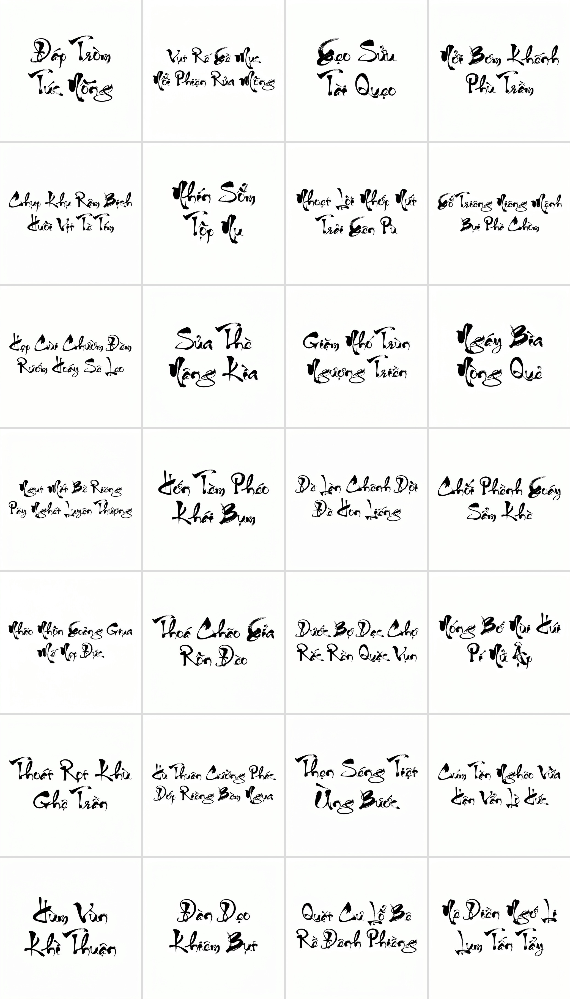
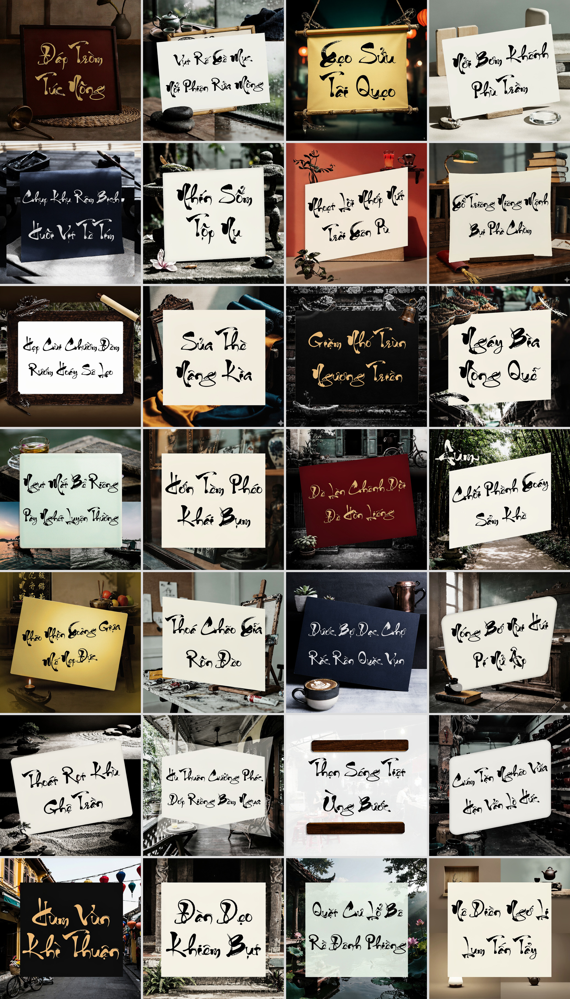

MINISTRY OF EDUCATION AND TRAINING

FPT UNIVERSITY

Fine-tuning Qwen Image for Generating Vietnamese Calligraphy Images with Accurate Diacritics

Author

Đỗ Tuấn Phong

A thesis submitted in partial fulfillment of the requirements for the degree of Master of Software Engineering

Supervisor:

Dr. Nguyễn Bích Thủy

© Copyright by Đỗ Tuấn Phong 2026

---

# Fine-tuning Qwen Image for Generating Vietnamese Calligraphy Images with Accurate Diacritics

Đỗ Tuấn Phong

Program: Master of Software Engineering

Specialization: Artificial Intelligence

FPT University

2026

---

## Abstract {-}

Quốc ngữ calligraphy renders the Latin-based Vietnamese script through calligraphic brushwork. Tone marks and vowel diacritics are linguistically mandatory, so a visually plausible image can still fail semantically if the model renders `Cữu` as `Cưu` or `Chưởng` as `Chưỡng`. The evaluated baseline outputs contain these errors because Vietnamese relies on small yet semantically decisive marks that must integrate with brushstroke geometry.

The study was initially registered under Qwen Image; however, the final implementation uses Ideogram4 after two earlier candidates were not selected for the experimental setting. Qwen Image exceeded the local VRAM budget and produced Vietnamese character errors. ERNIE Image preserved character counts more often in some examples, but its tokenizer was unstable on capitalized Vietnamese syllables. Because Ideogram4 uses Qwen3-VL-8B-Instruct as its text encoder, the study retained the diagnostic question of whether Qwen-family conditioning preserves Vietnamese diacritic signal before the DiT renders glyphs. The implemented DiT-LoRA pipeline probes that signal, expands the LoRA target from attention-only to `attention.qkv`, `attention.o`, `feed_forward.w1`/`w2`/`w3`, and `adaln_modulation`, stabilizes high-variance checkpoints through averaging, and trains directly on multi-word layouts.

Attention-only LoRA plateaued at 32–39/60. The wide-target configuration surpassed this plateau (48/60 for the highest-scoring single checkpoint, 52/60 after averaging). Since single-word gains did not transfer to multi-word images, a compound dataset of 4/5/7/8-word images covering all 406 Vietnamese diacritical token IDs was built. On the validation Eval28 panel (168 words), checkpoint averaging and a final `3e-5` follow-up reduced errors from 56/168 to 4/168 (97.6% word-level accuracy). After checkpoint selection, a held-out Test28 panel of the same size was rendered once and produced 3/168 errors (98.2% word-level accuracy). These results are reported for the Thu Phap Thanh Cong Unicode evaluation setting; other fonts and languages were not tested.

Keywords: Vietnamese calligraphy, Qwen Image, Ideogram4, fine-tuning, LoRA, Diffusion Transformer, Vietnamese diacritics, glyph binding.

---

## Acknowledgements {-}

I would like to express my deepest gratitude to Dr. Nguyễn Bích Thủy, my supervisor, for her guidance, feedback, and patience throughout the research process. The problem in this thesis changed many times: from initial Qwen-Image experiments, to ERNIE Image, then to Ideogram4, from checking individual Vietnamese diacritic errors to diagnosing conditioning signal and finally training on multi-word layouts. Her feedback helped the research maintain a clear direction when experimental results were noisy and when several plausible hypotheses had to be discarded based on evidence.

I also thank FPT University and the MSE-AI program for enabling me to pursue a topic that integrates artificial intelligence techniques with Vietnamese cultural heritage, including design, education, and the preservation of Quốc ngữ calligraphy.

I am grateful to the open-source communities and engineering teams that developed the tools used in this research, including Ideogram AI, the Qwen team, DiffSynth-Studio, PyTorch, HuggingFace Transformers, safetensors, and the Python machine learning ecosystem. The experiments in this thesis relied heavily on reproducible scripts, checkpoint management, LoRA conversion, and GPU-based evaluation.

Finally, I thank my family and friends for their encouragement and patience. Many important results of this thesis came from manually evaluating each calligraphy image, a time-consuming but necessary process to ensure the reliability of the conclusions.

---

# Table of Contents {-}

::: {#toc}
:::
\newpage

Acknowledgements

List of Tables

List of Figures

List of Appendices

1. Introduction

1.1. Problem Statement

1.2. Research Objectives and Scope

1.2.1. Research Objective Evolution

1.2.2. Research Objectives and Boundaries

1.3. Process Overview and Domain Challenges

1.3.1. Overall Research Pipeline

1.3.2. Domain-Specific Challenges

1.4. Literature Review

1.4.1. GAN-Based Methods

1.4.2. Diffusion Models

1.4.3. Diffusion Transformers and Multimodal Text Encoders

1.4.4. Parameter-Efficient Fine-Tuning

1.4.5. Commercial Models and Research Gap

1.5. Proposed Method and Contributions

1.6. Thesis Structure

2. Theoretical Foundations

2.1. AI Image Generation: From GANs to Diffusion Transformers

2.2. Ideogram4 Architecture

2.3. Parameter-Efficient Fine-Tuning Techniques

2.4. Vietnamese Calligraphy: Visual and Linguistic Characteristics

3. Implementation and Evaluation

3.1. System Setup

3.2. Data and Preprocessing

3.3. Diagnostic Probes

3.4. Fine-Tuning Configuration

3.5. Evaluation Protocol

3.6. Results

4. Conclusion

4.1. Theoretical and Practical Value

4.2. Summary of Key Results

4.3. Current Limitations

4.4. Future Directions

References

Appendices

---

# List of Tables {-}

**Table 1.1:** Backbone decision summary

**Table 1.2:** Comparison of competitors and baselines for Vietnamese calligraphy image generation

**Table 2.1:** Overview of the four main components in the Ideogram4 pipeline

**Table 3.1:** Hardware configuration

**Table 3.2:** Software environment

**Table 3.3:** Compound dataset composition

**Table 3.4:** Qwen3-VL signal probe results

**Table 3.5:** LoRA module groups in the DiT

**Table 3.6:** Single-word panel results

**Table 3.7:** Compound Eval28 result progression

**Table 3.8:** Remaining errors of the compound gold checkpoint

**Table 3.9:** Final gold checkpoints released with the thesis

**Table H.1:** Comparison image list

**Table J.1:** Reference and evidence traceability

---

# List of Figures {-}

**Figure 1.1:** Overall research pipeline for Vietnamese calligraphy image generation

**Figure 1.2:** Visual comparison of competitor methods and the proposed checkpoint

**Figure 1.3:** Comparison of base capabilities of Qwen Image, ERNIE Image, and Ideogram4 before fine-tuning

**Figure 2.1:** Ideogram4 architecture used in this thesis

**Figure 2.2:** Multi-layer Qwen3-VL conditioning fed into the DiT

**Figure 3.1:** Wide-target LoRA insertion points in the Ideogram4 DiT

**Figure 3.2:** No-bounding-box and bounding-box layout comparison for compound prompts

**Figure 3.3:** Font-rendered reference versus model-generated compound layout

**Figure 3.4:** Result progression from the single-word plateau to the final compound checkpoint

**Figure 3.5:** Before/after examples on difficult Vietnamese diacritical words

**Figure 3.6:** Compound Eval28 before/after comparison between `soup567` and the final checkpoint `soup_lr3e5_gold4_9to1`

**Figure 3.7:** Remaining errors of the current compound gold checkpoint

**Figure 3.8:** Testing the fine-tuned checkpoint for combining calligraphy with Ideogram4's base image generation capability

**Figure 3.9:** Full held-out Test28 compound panel rendered by the final checkpoint

**Figure 3.10:** Scene, material, and tilted-panel stress probe on the held-out Test28 phrases

---

# List of Appendices {-}

Appendix A: Main wide-target training command

Appendix B: Compound data generation command

Appendix C: Checkpoint post-processing and averaging script

Appendix D: Checkpoint registry

Appendix E: Evaluation directories

Appendix F: Remaining errors of the current compound gold checkpoint

Appendix G: Internal probe reports

Appendix H: Comparison figure inventory

Appendix I: Prompts used for comparison figures

Appendix J: Reference and evidence traceability

---

# 1. Introduction

## 1.1. Problem Statement

Quốc ngữ calligraphy renders the Latin-based Vietnamese script through calligraphic brushwork. Vietnamese carries a dense system of tone marks and diacritics, where a small diacritic difference can change lexical identity. `Cưu`, `Cừu`, `Cứu`, `Cửu`, `Cữu`, and `Cựu` have similar visual forms but distinct meanings.

Calligraphic rendering further increases this difficulty. Marks must be orthographically correct and also integrate into the brushwork: maintaining rhythm, stroke thickness variation, slant, and the handcrafted feel. A nặng dot should not appear as an unintended isolated mark; a ngã tilde should not collapse into a hỏi hook; circumflex and tone marks need correct positioning while remaining visually integrated with the stroke layout.

Recent text-to-image systems increasingly rely on large multimodal encoders and Diffusion Transformer architectures [15], [17], [21–22]. In the comparison examples used here, selected commercial models produce visually plausible calligraphy but do not allow fine-tuning on a specific font, do not guarantee reproducibility, and offer no control over individual Vietnamese diacritics. Rendering directly from a digital font preserves the exact target characters but does not add generated ink variation, dryness, pressure modulation, or stroke interaction beyond the font outlines. The detailed literature review is in Section 1.4, and the consolidated research gap with the quantitative comparison to prior work is in Section 1.4.5.

The topic was originally registered under the Qwen Image direction. During early experiments, Qwen Image proved impractical for this setup. Its VRAM requirements limited rapid local iteration, and its Vietnamese baseline produced character-level errors before tone-mark problems could be isolated. ERNIE Image more often preserved character counts than Qwen Image in the observed examples, but it remained limited by its tokenizer, where Mistral3/Ministral3 byte-level BPE disrupted syllable-level diacritic alignment, especially for capitalized forms like `Ở`, `Ảnh`, `Ước`. These observations are documented as internal experimental evidence in Appendix J. The model families themselves appear in [17, 21].

Ideogram4 was selected because its published technical description reports a 0.97 X-Omni English OCR score for in-image text rendering, a Qwen3-VL-based conditioning interface, and an FP8 release practical for local LoRA work [15, 16]. The research objective stayed the same: fine-tuning a modern image generation model for Vietnamese calligraphy with accurate diacritics. The backbone changed in response to the empirical results and implementation constraints.

## 1.2. Research Objectives and Scope

### 1.2.1. Research Objective Evolution

This section documents why the final implementation differs from the registered backbone. The research target remained Vietnamese calligraphy generation with accurate diacritics, while the model backbone changed after early experiments.

*Initial research objective (as registered).* Fine-tune Qwen Image with LoRA to generate Vietnamese Quốc-ngữ calligraphy with accurate tone marks and diacritics, on a specific calligraphy font and through a reproducible pipeline.

*Adjusted research objective (final implementation).* Build an Ideogram4 DiT-LoRA pipeline for the same end goal, accurate-diacritic Vietnamese calligraphy generation, after empirical evidence showed Qwen Image was not a suitable backbone for local iteration.

Across milestones, the target remained Vietnamese diacritic accuracy in calligraphy through parameter-efficient fine-tuning (PEFT) of a modern text-to-image model. The backbone decision is summarized in Table 1.1.

**Table 1.1.** Backbone decision summary.

| Milestone | Backbone | Status and reason |
|---|---|---|
| Initial (registered) | Qwen Image | Not selected: VRAM requirement exceeded the local iteration budget; Vietnamese baseline showed character-level errors before tone-mark errors could be isolated |
| Intermediate (surveyed) | ERNIE Image | Not selected: residual character errors; byte-level BPE (Mistral3/Ministral3) hampers syllable-level diacritic alignment, especially for capitalized forms |
| Final (implemented) | Ideogram4 | Selected: favorable observed trade-off among surveyed open models for text rendering and local fine-tuning feasibility (FP8 base + BF16 LoRA) |

The milestones map to three phases under the registered title. Phase 1 used Qwen Image as the planned backbone. Phase 2 tested whether a Qwen-family text encoder retains Vietnamese diacritic signal. Phase 3 implemented the final Ideogram4 pipeline, the only phase that produced a reproducible checkpoint. The encoder question remains comparable because Qwen Image uses Qwen2.5-VL and Ideogram4 uses Qwen3-VL. Both transitions followed the experimental constraints described in Section 1.1.

*Note on the registered title.* The official title retains "Qwen Image" because it follows the registered proposal. The experimental chapters report the Phase 3 Ideogram4 DiT-LoRA pipeline, whose Qwen3-VL encoder belongs to the same model family examined in Phase 2.

### 1.2.2. Research Objectives and Boundaries

The goal is to build a fine-tuning pipeline that generates Vietnamese calligraphy images with accurate diacritics. The implementation uses Ideogram4 and LoRA, staying within the registered Qwen Image topic [8, 15].

More concretely, the research analyzes where Ideogram4 exhibits errors on Vietnamese calligraphy. It tests whether the errors come from the Qwen3-VL text encoder, the prompt, insufficient LoRA capacity, or the DiT's glyph-binding behavior. From that diagnosis, a LoRA configuration is designed to improve diacritic rendering without full fine-tuning. Data and evaluation panels are built for both single-word and multi-word layouts, and single-word gains are checked for transfer to compound layouts. The aim is to provide a reproducible pipeline in addition to a checkpoint. The pipeline covers training, checkpoint conversion, evaluation rendering, and manual scoring.

The experimental scope is deliberately kept narrow. The base model is Ideogram4 with a frozen Qwen3-VL text encoder. LoRA adapters go on the DiT backbone; the target style is Thu Phap Thanh Cong Unicode at 1024×1024. Word-level accuracy is evaluated by human inspection, since OCR is not reliable enough for stylized Vietnamese calligraphy. Content ranges from single words to compound 4/5/7/8-word images split across two lines.

The claim is not to solve all calligraphic styles or all forms of Vietnamese text rendering. The scope is an experimental pipeline for one specific font, with diacritic accuracy as the main target.

## 1.3. Process Overview and Domain Challenges

### 1.3.1. Overall Research Pipeline

The pipeline began by observing Ideogram4 behavior on Vietnamese calligraphy prompts without fine-tuning, cataloguing error patterns before modifying model parameters. Hidden-state probes, token-span probes, and projection probes were then used to check whether diacritic signal survives in Qwen3-VL and reaches the DiT input [15, 16]. After the bottleneck analysis, LoRA adapters were trained on difficult Vietnamese words [8]. The first LoRA configuration targeted attention modules; after this configuration plateaued, the target set was widened to more DiT modules.

Checkpoint instability introduced a separate optimization challenge after the single-word phase. Compatible checkpoints that seemed to sit in the same optimization basin were averaged, borrowing from the model soups idea [13, 14] as a way to stabilize results without increasing inference-time computational cost. The last phase moves to compound layouts: multi-word two-line data is generated from the target calligraphy font, starting from the highest-scoring single-word checkpoint, and evaluated on a fixed compound panel.


**Figure 1.1.** Overall research pipeline for Vietnamese calligraphy image generation. The pipeline begins with baseline observation, proceeds through Qwen3-VL/DiT signal diagnosis and wide-target LoRA training, then stabilizes compatible checkpoints through averaging before moving to compound-layout training and fixed-seed evaluation.

### 1.3.2. Domain-Specific Challenges

Vietnamese orthography is a primary challenge. Six tones, numerous vowel variants (`â`, `ă`, `ê`, `ô`, `ơ`, `ư`), and a small mark error can invalidate a word. In calligraphy, marks must blend into the brushwork rather than sitting on top like a printed font. If marks are too detached, the image loses calligraphic coherence; if marks are too blended, readers may misread them.

Fine-tuning and layout create a second challenge. Attention-only LoRA reaches 32–39/60 and then stalls; adjusting attention alone does not fix glyph geometry. In addition, the same training recipe can produce either a usable checkpoint or a severe collapse; one warm-continue round, for instance, produced widespread spurious nặng dots. Multi-word images multiply the difficulty because the model must jointly model layout, spacing, character identity, and local glyph geometry [10], [24–26].

## 1.4. Literature Review

### 1.4.1. GAN-Based Methods

GANs train a generator and discriminator adversarially [1]. For Chinese calligraphy, GAN-based methods have been developed to convert printed glyphs into calligraphic style or to perform few-shot style transfer [2, 3, 30]. Mode collapse is a known failure mode, and StrokeGAN [3] specifically addresses it for Chinese font generation through stroke encoding. Covering all Vietnamese diacritic combinations is still difficult with these architectures.

### 1.4.2. Diffusion Models

Diffusion models generate images through iterative denoising [4, 5] and are often reported to provide more stable training dynamics than GANs. Latent Diffusion cuts computation by denoising in latent space rather than pixel space, which made high-resolution generation practical [6]. These methods have also been adapted for Chinese calligraphy generation and style transfer (e.g., Calliffusion [29]).

### 1.4.3. Diffusion Transformers and Multimodal Text Encoders

Diffusion Transformers swap the U-Net for transformer blocks in the denoising network [7]. Transformers make it easier to mix text tokens and image tokens, but accurate text rendering is still hard because the model has to convert symbolic signals into spatial geometry [10], [24–26]. Specific text-accuracy-focused methods such as GlyphControl [25] and Glyph-ByT5 [26] have addressed this by injecting glyph-level conditioning, but the underlying difficulty of mapping abstract language symbols to spatially coherent character geometry remains. For Vietnamese, the signals that matter are often tiny yet linguistically decisive.

Several recent models pair DiT with large-scale text encoders [15], [17], [21–22]. Three open-source approaches were tested, revealing different architectural choices:

- Qwen-Image (Qwen Team, 20B params, MMDiT, Apache 2.0, arXiv 2508.02324) uses the Qwen2.5-VL text encoder and reports leading Chinese text rendering results [21]. Zero-shot experiments conducted in this study showed frequent failures on diacritical Vietnamese, including vowel substitutions, missing consonants, inconsistent renderings across seeds, and omitted or misplaced tone marks. The VRAM cost alone would have made it impractical for local iteration.

- ERNIE-Image (Baidu) pairs a Mistral3/Ministral3 text encoder with byte-level BPE [17]. Byte-level BPE works well for many languages but destabilizes Vietnamese syllable alignment in the tokenizer checks used here; capitalized forms like `Ở`, `Ảnh`, `Ý`, `Ước`, `Nguyễn` can decompose into raw bytes and decode incorrectly. In the observed examples, it preserved character count more often than Qwen Image, but the tokenizer instability ruled it out for diacritic-accurate fine-tuning.

- Ideogram4 (Ideogram AI, 9.3B params, published 2026-06-03) is Ideogram's first open-source text-to-image model, trained from scratch [15]. It uses a fully single-stream Diffusion Transformer (34 layers) with concatenated text/image tokens and no separate text/image branch. The text encoder is Qwen3-VL-8B-Instruct, with hidden states extracted from 13 intermediate layers [16]. It uses flow-matching [19–20] rather than pure DDPM, supports native resolution from 256 to 2048, and the FP8 base + BF16 LoRA design enables local fine-tuning. Its public technical report gives a 0.97 X-Omni English OCR score for text rendering, 0.69 7Bench mIoU for layout control, 0.76 SpatialGenEval spatial accuracy, and 0.89 Prism prompt-alignment score [15]. It also reports a designer-preference ELO of 1062, ranking second overall among the nine compared systems and first among the open-weight systems in that internal arena [15]. These reported metrics do not measure Vietnamese calligraphy directly; they support selecting Ideogram4 for subsequent project-specific Vietnamese evaluation.

The project-specific raw Ideogram4 check then measured Vietnamese behavior directly on six difficult calligraphy words under structured JSON prompts. In that pilot, changing only the descriptive prompt fields from English to Vietnamese with an anti-Chinese-character instruction increased the correct Latin Vietnamese character-rendering rate from about 25% to about 83%. On the six-word set, raw Ideogram4 made one character-level error (`Phúc` -> `Phức`) but only two words were tone-exact (`Vượng`, `Hạnh`), so the base model provided a stronger character-level baseline but remained insufficient for Vietnamese diacritic accuracy. This observation motivates the fine-tuning and glyph-binding pipeline rather than treating the base model as sufficient for Vietnamese calligraphy.

A notable pattern across all three is that they use Qwen3-VL/Mistral3-family, or comparable, text encoders for conditioning. The original research question about linguistic signal in the Qwen family therefore remains relevant across the evaluated backbones.

### 1.4.4. Parameter-Efficient Fine-Tuning

Full fine-tuning of large text-to-image models is expensive and risks degrading pre-trained capabilities. LoRA learns low-rank updates on selected modules while keeping the original weights frozen [8], making it suitable for learning a specific calligraphic style without substantially altering the base model's visual priors.

DreamBooth demonstrated that targeted fine-tuning can specialize a generative model to a desired subject or concept [9]. The broader progress of image-text representation learning (CLIP, BLIP-2) indicates that image generation depends strongly on conditioning quality [11, 12]. For LoRA specifically, scaling and rank behavior matter in practice, which is why careful control is maintained over adapter rank and update strength [27].

One empirical finding is that LoRA target module selection matters in this setup. Attention-only LoRA could not push past the Vietnamese diacritic plateau, which motivated expanding into feed-forward and adaLN modulation to influence glyph geometry directly.

### 1.4.5. Commercial Models and Research Gap

Several adjacent research areas have explored calligraphy generation or Vietnamese text rendering, but the works reviewed in this thesis did not identify a method that combines fine-tuning with Vietnamese diacritic accuracy targets:

- Chinese calligraphy generation uses GAN-based and diffusion-based methods (e.g. CalliGAN [2], Calliffusion [29], ZiGAN [30], StrokeGAN [3]) but targets a logographic script without tone marks; diacritic accuracy is not a defined metric. The reported metrics focus on visual similarity (SSIM [23], FID) and character-class recognition, not on tone-mark-level orthographic correctness. Recent Chinese calligraphy diffusion work has also extended to column-level synthesis (e.g. UniCalli [31], ICLR 2026) and English/Chinese/Korean/Japanese multilingual calligraphy (e.g. Calligrapher [32], 2025), but neither addresses Vietnamese diacritics.

- Vietnamese text-to-image models (e.g. VietHann/T2I [34], Aug 2025) target general-purpose Vietnamese prompt conditioning. The published architecture uses a SigLIP/multilingual-CLIP text encoder with a DiT diffusion core, which is well-suited to general Vietnamese captions but is not designed for tone-mark-level accuracy on stylized calligraphy. The publicly released artifact at the time of writing is a design document (README + two demo images, no code release), with evaluation limited to FID, CLIPScore, and PickScore rather than character-level diacritic accuracy. The architecture choice, a multilingual CLIP family encoder, may be disadvantaged for Vietnamese diacritics, based on documented crosslingual tokenizer inequities [33]: stacked-diacritic Vietnamese syllables can be fragmented into byte-level or Unicode sub-tokens, which can weaken the diacritic embedding available for fine-grained glyph binding downstream.

- Open-source text-to-image models (Qwen-Image [21], ERNIE-Image [17], Ideogram4 [15], FLUX [22]) report general text-rendering benchmarks mostly in their default languages (Chinese, English, or broad multilingual prompts). Their published technical descriptions do not report Vietnamese diacritic rendering accuracy on stylized calligraphy, and the available models do not provide fine-tuning recipes for Vietnamese fonts. Qwen-Image-2.0 [35] is announced in an arXiv technical report (May 2026), but its weights are not publicly released at the time of writing; earlier-iteration Qwen-Image failed on Vietnamese diacritics in zero-shot experiments conducted for this thesis (Section 1.4.3).

- Digital font rendering (e.g. fontforge, CSS `@font-face`) preserves exact target text but provides only the variation encoded in the font outlines. It is not a learned system and does not address brushwork dynamics such as generated ink variation, pressure modulation, or stroke interaction.

- Black-box commercial tools (Nano Banana 2, GPT Image 1.5 High, Ideogram online) generate visually plausible Vietnamese calligraphy examples but operate as closed systems: no published checkpoint, no reproducible seed control, no fine-tuning on private data. The output style cannot be adapted to a specific calligraphy font or school.

- Evaluation methodology for stylized text remains open. OCR engines such as Vintern-3B-R-beta achieve 16.27% CER on model-generated Vietnamese calligraphy images (Section 13.7 of `eval_baseline_results_4w.md`), so the surveyed prior works often rely on qualitative samples rather than automated diacritic-accuracy metrics.

The survey in this thesis did not identify prior work demonstrating a reproducible, open-source fine-tuning pipeline with quantitative Vietnamese diacritic-accuracy results on stylized calligraphy at the level measured here (97.6% word-level accuracy on validation Eval28 and 98.2% on held-out Test28, Section 3.6). The closest published numbers are either:
- (a) qualitative visual comparisons without diacritic-accuracy metrics (many surveyed open-source text-to-image reports), or
- (b) digital-font rendering accuracies of ~100% but without any learned calligraphic dynamics, or
- (c) Chinese-logographic calligraphy accuracies that do not transfer to Vietnamese tone-mark evaluation.

Based on this survey, the implementation in this thesis is an open-source Ideogram4 DiT-LoRA pipeline that:
- targets Vietnamese diacritic accuracy as the primary quantified evaluation metric (97.6% word-level on validation Eval28 and 98.2% on held-out Test28, Section 3.6);
- provides a reproducible checkpoint, training script, dataset, and evaluation panel through Hugging Face and GitHub;
- documents an evidence-driven pipeline for one font (Thu Phap Thanh Cong Unicode) that can be tested as a starting point for additional fonts and other languages with stacked diacritics (e.g. tonal languages in the same family).

Table 1.2 summarizes the competitive landscape.

**Table 1.2.** Comparison of competitors and baselines for Vietnamese calligraphy image generation.

| System / Method | Strengths | Limitations for This Work |
|---|---|---|
| Digital font rendering | Exact target characters and diacritics | Static glyphs; no generated brushstroke variation |
| Black-box commercial tools | Visually plausible selected examples; prompt-based access | Default style; no fine-tuning on private data; hard to reproduce |
| Qwen Image | Large open model family; initial registered direction | VRAM-intensive; weak Vietnamese baseline |
| ERNIE Image | More frequent character-count preservation than Qwen Image in observed examples; occasional correct phrases | Character errors; byte-level BPE breaks syllable/diacritic alignment |
| Base Ideogram4 | Reported 0.97 X-Omni English OCR text score; raw Vietnamese pilot had about 83% Latin-character rendering under Vietnamese JSON prompts | Only 2/6 tone-exact in the six-word raw Vietnamese pilot; errors on difficult diacritics and multi-word layouts |
| Existing Chinese-calligraphy work (e.g. [2], [3], [29], [30]; UniCalli [31] ICLR 2026; Calligrapher [32] 2025) | Established pipelines for logographic scripts; column-level synthesis; multilingual extension | No tone-mark evaluation metric; no Vietnamese diacritic accuracy reported |
| Existing Vietnamese text-to-image work (e.g. VietHann/T2I [34], Aug 2025) | Vietnamese prompt support; DiT-based architecture | Multilingual CLIP/SigLIP tokenization fragments stacked diacritics; FID/CLIPScore-only evaluation; no code or fine-tuning recipe for calligraphy; no character-level accuracy target |
| Proposed DiT-LoRA pipeline | Learns specific font, reproducible, improves single-word and compound results on evaluated panels | Limited to one primary font and manual evaluation panel |

Table 1.2 shows that, among the surveyed alternatives, no existing open-source system both fine-tunes for Vietnamese calligraphy and reports quantitative diacritic-accuracy metrics with artifacts made available for replication.


**Figure 1.2.** Visual comparison of competitor methods and the proposed checkpoint. Comparable Vietnamese calligraphy prompts are compared across digital font rendering, Nano Banana 2 as a black-box commercial image generator, Qwen Image, ERNIE Image, base Ideogram4, and the final fine-tuned Ideogram4 checkpoint. The figure compares orthographic correctness, visual calligraphy style, reproducibility, and fine-tuning capability.


**Figure 1.3.** Base-model capability comparison before fine-tuning. Qwen Image, ERNIE Image, and base Ideogram4 are compared using archived Vietnamese calligraphy-style base renders. This figure separates base-model selection from LoRA improvement and clarifies why Ideogram4 was selected as the final experimental backbone.

## 1.5. Proposed Method and Contributions

This thesis implements an Ideogram4 DiT-LoRA pipeline for the registered Qwen Image objective of Vietnamese calligraphy image generation, with glyph binding treated as the primary mechanism for improving diacritic accuracy.

Signal probes, LoRA target selection, checkpoint averaging, compound training, and manual evaluation are treated as connected steps for the same bottleneck rather than as independent heuristics.

Relative to the original Qwen-Image direction, the final implementation differs in three ways: the backbone is Ideogram4, the identified bottleneck is DiT glyph binding rather than a globally diacritic-blind text encoder, and the evaluation extends from individual words to multi-word and long-sentence calligraphic behavior.

## 1.6. Thesis Structure

Chapter 2 covers GANs, diffusion, Diffusion Transformers, Ideogram4, LoRA, FP8/BF16, and Vietnamese calligraphy characteristics. Chapter 3 describes the implementation, data, diagnostic probes, fine-tuning configuration, and evaluation results. Chapter 4 summarizes the results, limitations, and proposed extensions.

---

# 2. Theoretical Foundations

## 2.1. AI Image Generation: From GANs to Diffusion Transformers

GANs introduced adversarial image generation but did not address the fine-grained character control required here [1]. DDPM and diffusion models brought stability by learning to reverse a noise-adding process [4, 5]. Latent Diffusion cut costs by operating in latent space [6]. Diffusion Transformers then replaced the convolutional backbone with transformers, a suitable design when text and image tokens need to interact [7].

For Vietnamese calligraphy, the Diffusion Transformer must jointly model several factors: prompt semantics, calligraphic style, text placement, and small diacritical marks. In this setup, the observed errors are not OCR errors or font errors; they are interpreted here as binding errors between linguistic conditioning and visual geometry.

## 2.2. Ideogram4 Architecture

The Ideogram4 pipeline used in this work consists of four main components, based on the public technical description and the DiffSynth-Studio implementation used to load the model [15, 18].

**Table 2.1.** Overview of the four main components in the Ideogram4 pipeline.

| Component | Role | Significance for Vietnamese Calligraphy |
|---|---|---|
| Qwen3-VL text encoder | Encodes structured JSON prompt in text-only mode | Provides multilingual conditioning examined by the probes |
| Ideogram4 DiT | Generates image latent conditioned on text | Primary LoRA target |
| Euler flow-matching sampler | Integrates the denoising trajectory with asymmetric CFG | Controls inference trajectory during evaluation renders |
| VAE | Decodes latent into 1024×1024 image | Produces final image |


**Figure 2.1.** Ideogram4 architecture used in this thesis. The fine-tuning pipeline freezes the Qwen3-VL text encoder and Ideogram4 base weights, inserts LoRA adapters into selected DiT modules, and decodes the generated latent image through the VAE.

The Qwen3-VL text encoder is kept frozen. Ideogram4 extracts hidden states from 13 intermediate Qwen3-VL layers, concatenates them into a large conditioning vector, then projects through `llm_cond_norm + llm_cond_proj` into the DiT [15, 16]. The public model specification also reports 2048 maximum text tokens, 34 DiT layers, 18 attention heads, 4608 embedding dimension, and FP8/NF4 quantized releases [15]. The probes in this work examine both tap-space and projection-space to see how far the diacritic signal persists.


**Figure 2.2.** Multi-layer Qwen3-VL conditioning fed into the DiT. Hidden states from multiple Qwen3-VL layers are concatenated, normalized, and projected before entering the Ideogram4 DiT. This figure supports the diagnostic question of whether Vietnamese diacritic signal is already weak at the conditioning interface or is lost later during glyph binding.

The DiT is where LoRA is inserted. Key modules include attention, feed-forward, and adaLN modulation. When attention-only LoRA proved insufficient, the results suggested that broader DiT-module adaptation is beneficial for correcting character geometry.

## 2.3. Parameter-Efficient Fine-Tuning Techniques

LoRA assumes weight updates can be approximated by the product of two low-rank matrices [8]. Given original weight `W`, the LoRA-adapted weight `W'` follows the standard decomposition

$$W' = W + \frac{\alpha}{r} B A$$

where $B \in \mathbb{R}^{d \times r}$ and $A \in \mathbb{R}^{r \times d}$ are the two low-rank factors ($r \ll d$), and $\alpha$ is the scaling factor. For rsLoRA [27], the scale is modified to $\alpha / \sqrt{r}$ to stabilize training at higher ranks.

FP8 base weights are kept frozen while the LoRA branch operates in BF16. This follows the general idea of parameter-efficient adaptation over frozen or quantized base models [8, 28]; the exact FP8/BF16 conversion details are specific to the local Ideogram4 pipeline. After training, checkpoints need conversion to the correctly scaled inference format.

When multiple LoRA checkpoints sit in the same optimization basin but have different error profiles, they are averaged. Averaging adapters reduces variance and produces more stable checkpoints without adding inference cost [13, 14].

## 2.4. Vietnamese Calligraphy: Visual and Linguistic Characteristics

Quốc ngữ calligraphy combines the Latin alphabet, the Vietnamese diacritic system, and calligraphic brushwork. A single word can carry multiple layers of marks: circumflex or horn diacritics on vowels, plus tone marks. Common errors in the experimental observations include missing tone marks, hỏi/ngã confusion, spurious nặng dots, vowel substitutions (`ư/u`, `ơ/o`, `â/ă/a`), and character drops in multi-word images.

On the Unicode side, Vietnamese can be composed or decomposed. Tokenizers handle uppercase and lowercase differently. Coverage is therefore checked at the token ID level rather than relying on visible characters alone. The final compound set covers 406 Vietnamese diacritical token IDs.

---

# 3. Implementation and Evaluation

## 3.1. System Setup

### 3.1.1. Hardware Configuration

**Table 3.1.** Hardware configuration.

| Component | Configuration |
|---|---|
| GPU | Local high-VRAM GPU used for Ideogram4 FP8 inference and LoRA training |
| Precision | FP8 base weights, BF16 LoRA |
| Storage | Stores checkpoints, rendered data, probe artifacts, and evaluation results |
| Runtime | Python, PyTorch, DiffSynth-Studio, safetensors |

### 3.1.2. Software Environment

**Table 3.2.** Software environment.

| Component | Role |
|---|---|
| DiffSynth-Studio | Load and inference Ideogram4 |
| PyTorch | LoRA training |
| safetensors | Checkpoint storage |
| HuggingFace Transformers | Tokenizer/text encoder |
| Experiment scripts | Build dataset, train, convert, render, probe |

### 3.1.3. Reproducible Experiment Process

Each experimental branch is managed with its own checkpoint name, log, and render folder. Evaluation panels use the same base seed to avoid confusing checkpoint improvements with seed variance. When a checkpoint satisfies the evaluation criterion, it is retained as an independent candidate rather than overwriting prior checkpoints.


**Figure 3.1.** Wide-target LoRA insertion points in the Ideogram4 DiT. Compared with attention-only LoRA, the final target set includes attention projections, feed-forward layers, and adaLN modulation, which are expected to affect both token interaction and glyph geometry.

## 3.2. Data and Preprocessing

### 3.2.1. Single-Word Data

The initial phase uses a list of diacritical Vietnamese words to generate single-word images. The fragile 60 panel measures easily confused words during fine-tuning. Each word is scored as correct or incorrect by manual inspection of the generated image, prioritizing orthographic and diacritic correctness over automatic metrics like SSIM.

### 3.2.2. Token Coverage

Token coverage is checked at the tokenizer level because the same character can map differently in uppercase and lowercase. Enumerating over the lexicon revealed 406 Vietnamese diacritical token IDs that needed coverage. That finding pushed the design toward compound data covering both cases rather than assuming one form would suffice; the generation command is in Appendix B.

### 3.2.3. Compound Dataset

The compound set consists of 4/5/7/8-word images split into two center-aligned lines, rendered from the Thu Phap Thanh Cong Unicode font for stable targets. Table 3.3 summarizes the dataset composition.

**Table 3.3.** Compound dataset composition.

| Item | Count |
|---|---:|
| Compound images (4/5/7/8 words) | 2808 |
| Supplementary single-word images | 147 |
| Metadata records (total) | 2955 |
| Vietnamese diacritical token IDs covered | 406/406 |

The compound set was designed after observing fewer multi-word errors when the model was trained directly on multi-word examples. As a result, multi-word layouts were brought into the training distribution instead of optimizing single words and assuming automatic generalization to sentences.

### 3.2.4. Bounding-Box-Free Prompts

Bounding-box experiments produced insufficient layout adherence. Narrow cell-based or line-level bounding boxes were not consistently followed; some words overlapped in position or stayed incorrect. By contrast, no-bounding-box prompts with center-aligned target images produced layouts closer to the centered two-line targets in the tested prompts. Therefore, no-bounding-box prompts are used for the compound bridge, with line alignment learned from the target data.


**Figure 3.2.** No-bounding-box and bounding-box layout comparison for compound prompts. The same six-word prompt is rendered under no-bbox, wide-bbox, and row-bbox conditions to show why the final compound data relies on centered target images rather than strict bounding-box instructions.


**Figure 3.3.** Font-rendered reference versus model-generated compound layout. The comparison shows that the font-rendered compound targets align with the model's centered two-line layout in the tested examples sufficiently to serve as supervised training data while preserving exact Vietnamese characters and diacritics.

### 3.2.5. Train, Validation, and Test Roles

The supervised training data consists of the rendered font datasets described above, including the compound 2808-image set and supplementary single-word examples. Fragile60 and compound Eval28 are validation and model-selection panels: they were used repeatedly to compare LoRA target sets, checkpoints, learning rates, and checkpoint-averaging ratios. Therefore, the 4/168 Eval28 result is treated as the final validation result rather than as an untouched test-set score.

After the final `soup_lr3e5_gold4_9to1` checkpoint was frozen, an additional held-out Test28 panel was generated for one-time reporting. It matches the Eval28 shape (28 compound images, 168 total words, seven groups each for 4/5/7/8 words), excludes all Fragile60 and Eval28 words, and has no exact ordered or unordered group overlap with the audited compound training metadata or Eval28 groups. Since 97 of its 168 words appear somewhere in the audited training metadata, Test28 is best interpreted as a held-out phrase/group/panel evaluation rather than a fully unseen-token test; 71/168 words are unseen in the audited compound training metadata.

## 3.3. Diagnostic Probes

### 3.3.1. Qwen3-VL Signal Probe

The question was whether Qwen3-VL discards Vietnamese diacritic signal before transmission to the DiT. The probe compares a canonical list of 990 words from `manifest_words.json` against a candidate lexicon of 7,165 words from the 7,184 set. The full report is in Appendix G. Results:

**Table 3.4.** Qwen3-VL signal probe results.

| Metric | Value |
|---|---:|
| Canonical words | 990 |
| Candidate lexicon | 7,165 |
| Elapsed time | 81.1 s |
| Span miss | 0 |
| Very hard | 42 |
| Hard | 225 |
| Medium | 567 |
| Easy | 156 |

Interpretation: Qwen3-VL does not appear uniformly insensitive to Vietnamese diacritics. However, the hard and very-hard categories are sufficiently large for Qwen-derived signals to serve as risk filters.

### 3.3.2. Cưu/Cừu/Cữu Family Probe

Training rounds kept producing `Cưu` and `Cữu` as `Cừu`, so a small probe on the six tones (Cưu, Cừu, Cứu, Cửu, Cữu, Cựu) was run. The detailed report is in Appendix G.

The probe measures both tap-space and proj-space after `llm_cond_norm + llm_cond_proj`. Results do not strongly support the hypothesis that `Cừu` is a global attractor in Qwen conditioning. These results support the interpretation that the remaining errors are more likely associated with DiT/glyph-binding behavior or deeper visual priors.

### 3.3.3. Probe Interpretation

Based on these probes, the strategy was not shifted entirely toward training the text encoder. Some words have nearby conditioning signals and can be mined, but many image errors occur even when Qwen signal remains distinguishable. For those words, the experiments support focusing on DiT/glyph binding through LoRA and correctly distributed visual data.

## 3.4. Fine-Tuning Configuration

### 3.4.1. Attention-Only Baseline

Attention-only LoRA was tried first because it was expected to carry less risk to base-model behavior. Results plateaued at approximately 32–39/60 on the fragile panel.

The observed Vietnamese diacritic errors were not resolved by attention-only adaptation; the results suggested that modules with stronger influence on stroke geometry required intervention.

### 3.4.2. Wide-Target DiT-LoRA

The LoRA target was expanded to the module groups in Table 3.5.

**Table 3.5.** LoRA module groups in the DiT.

| Module group | Target module(s) | Intended role |
|---|---|---|
| Attention input projection | `attention.qkv` | Adjust query/key/value text-image interaction |
| Attention output projection | `attention.o` | Adjust attention output integration |
| Feed-forward network | `feed_forward.w1`, `feed_forward.w2`, `feed_forward.w3` | Influence nonlinear glyph and stroke geometry |
| Adaptive layer normalization modulation | `adaln_modulation` | Influence conditioning strength and block-wise modulation |

The highest-scoring single checkpoint reached 48/60. Warm-continue rounds were unpredictable: some improved, others dropped sharply (wide8, for instance, collapsed).

### 3.4.3. Gentle Warm-Continue

Gentle warm-continue uses a mild learning rate and starts from a high-scoring checkpoint. Long sequential continuation was avoided. Each branch was treated as an independent sample from the high-scoring region, and branches satisfying the evaluation gate were included in checkpoint averaging.

### 3.4.4. Checkpoint Averaging

The `soup567` checkpoint was created by averaging the three highest-scoring single-checkpoint weights (`r5`, `r6`, `r7`) element-wise, following the model soups recipe of Wortsman et al. [13]. Let $W_i$ denote the weight tensor of checkpoint $i$, and $\bar{W}_{\text{soup}}$ the averaged weight. The operation is

$$\bar{W}_{\text{soup567}} = \frac{1}{3} \sum_{i \in \{r5, r6, r7\}} W_i.$$

The averaged checkpoint achieved 52/60 on the single-word fragile panel, higher than every previous single checkpoint on the same panel. Adding `r9` to form `soup5679 = mean(r5, r6, r7, r9)` stayed at 52/60 with no gain but more stable behavior across seeds.

For the compound bridge, the same averaging procedure was applied iteratively across the four rounds (`e4`, `r2`, `r3`, `r4`), each combining the latest branch output with the previous stable checkpoint. The sequence of compound soup checkpoints was: `soup_e4r2r3` → `soup_e4r2r3r4` (the Gold4 milestone) → `compound_lr3e5_from_gold4` → `soup_lr3e5_gold4_9to1` (the final compound gold, 90% new branch + 10% Gold4).

The `soup_e4r2r3r4` checkpoint became the stable Gold4 milestone with 6 errors on Eval28. From there, a follow-up branch at learning rate `3e-5` reduced the error count to 5; a light soup at 90% `lr3e5` branch + 10% Gold4 reached 4 errors and became the final compound checkpoint.

## 3.5. Evaluation Protocol

### 3.5.1. Manual Word-Level Evaluation

Given the observed OCR error rate on this stylized calligraphy set (Vintern-3B-R-beta, 16.27% CER; Section 13.7 of `eval_baseline_results_4w.md`), manual evaluation was used as the primary metric. This aligns with the broader difficulty of accurate visual text rendering in generated images [10], [24–26]. A word counts as correct if the right characters, the right diacritics, and no extra marks that change meaning are visible. SSIM can serve as a supporting image-similarity reference [23], but it is not used as the decision metric.

### 3.5.2. Single-Word Fragile Panel

The fragile panel of 60 contains difficult words that commonly suffer from diacritic or character errors. It is used as a validation panel to track single-word progress and guide checkpoint selection. The base seed stays fixed to avoid seed confounding.

### 3.5.3. Compound Eval28

Compound Eval28 has 28 images, each with multiple words (168 words total). This panel more directly tests the project's target than single words because it covers layout, spacing, font size, and the ability to keep diacritics correct when multiple tokens compete in the same image. Eval28 is the main validation and model-selection panel for the compound phase. Evaluation directories for the major checkpoints are in Appendix E.

### 3.5.4. Held-Out Compound Test28

After checkpoint selection, the final checkpoint is also evaluated on `compound_test28_heldout_seed20260630`, a held-out panel generated after the final model choice. This panel uses the same 28-image / 168-word size as Eval28, with the same 4/5/7/8-word group distribution and render seed 7000, but excludes Fragile60 and Eval28 words. The panel manifest, full-panel figure, and manual scoring file are stored under `experiments/results/coverage_v10_eval/` and `docs/thesis/figures/`.

### 3.5.5. Testing Preservation of Base Image Generation Capability

Orthographic correctness alone is insufficient; evaluation must also assess whether LoRA degrades Ideogram4's base image-generation capabilities. The qualitative panel includes context-rich prompts with Vietnamese calligraphic text in Tết greeting-card, ink-painting, festival-banner, and poster-layout scenes. A later stress probe reuses the held-out Test28 phrases in richer scenes with material changes and tilted paper panels; in that probe, "slant" refers to the pose of the paper or panel in perspective, not italic lettering. These panels do not replace Eval28 or held-out Test28, but provide additional qualitative assessment: a checkpoint is preferred if it improves text while preserving comparable backgrounds, layouts, lighting, materials, and textures in the inspection panel.

## 3.6. Results


**Figure 3.4.** Result progression from the single-word plateau to the final compound checkpoint. The chart summarizes the improvement path from attention-only LoRA, wide-target single-word training, checkpoint soup, compound bridge training, Gold4, and the final `soup_lr3e5_gold4_9to1` checkpoint.

### 3.6.1. Single-Word Results

**Table 3.6.** Single-word panel results.

| Checkpoint / Phase | Correct Words / 60 |
|---|---:|
| Attention-only plateau | 32-39 |
| Wide-target r1 | 41 |
| Wide-target r2 | 42 |
| Wide-target r3 | 43 |
| Wide-target r4 | 41 |
| Wide-target r5 | 46 |
| Wide-target r6 | 48 |
| Wide-target r7 | 47 |
| Wide-target r8 | 38 |
| `soup567` | 52 |
| `soup5679` | 52 |

Wide-target surpassed the attention-only plateau, but warm-continue exhibits high variance. Checkpoint soup was more stable than relying on individual checkpoints.


**Figure 3.5.** Before-and-after examples on difficult Vietnamese diacritical words. The panel compares difficult single-word cases before and after wide-target training and checkpoint averaging, illustrating reductions in tone-mark loss, wrong tone substitution, and vowel-diacritic confusion.

### 3.6.2. High-Variance Behavior

Wide8 is analyzed separately because it used the same general recipe but dropped sharply to 38/60 with many spurious nặng dots. The log showed no checkpoint corruption or NaN. The observed checkpoint variance suggests that diacritic rendering is sensitive to small optimization changes. This is the rationale for relying on soup and manual gating.

### 3.6.3. Compound Bridge Results

**Table 3.7.** Compound Eval28 result progression.

| Checkpoint | Errors / 168 |
|---|---:|
| `soup567` baseline | 56 |
| `compound_bridge` e4 | 26 |
| `compound_bridge_r2` | 19 |
| `compound_bridge_r3` | 18 |
| `soup_e4r2r3` | 13 |
| `r4_from_soup` | 15 |
| `soup_e4r2r3r4` / Gold4 | 6 |
| `compound_lr2e5_from_gold4` | 6 |
| `soup_gold4_lr2e5_3to1` | 7 |
| `compound_lr3e5_from_gold4` | 5 |
| `soup_lr3e5_gold4_3to1` | 6 |
| `soup_lr3e5_gold4_9to1` | 4 |

The post-Gold4 process showed that both learning rate and soup ratio affect the result. The `5e-5` branch updated too aggressively and created many new errors. `2e-5` held at 6 errors but could not improve on the milestone. In this follow-up, `3e-5` reduced the error count to 5. During weighted checkpoint averaging with Gold4, the 75/25 ratio reintroduced some previously corrected errors; the 90/10 ratio retained most new-branch improvements while using Gold4 as a minor regularization term.


**Figure 3.6.** Compound Eval28 before-and-after comparison. Representative fixed-seed Eval28 prompts are shown for `soup567` and the final compound checkpoint `soup_lr3e5_gold4_9to1`, illustrating the reduction from 56/168 errors to 4/168 errors on multi-word two-line calligraphy images.

Final compound checkpoint (relative path; full registry in Appendix D): `experiments/checkpoints/coverage_v10_compound_soup_lr3e5_gold4_9to1/step-soup_infer.safetensors`.

Remaining errors on Eval28 are concentrated in visually close Vietnamese diacritic or vowel variants (Table 3.8).

**Table 3.8.** Remaining errors of the current compound gold checkpoint.

| Target | Predicted | Error type |
|---|---|---|
| `Hấn` | `Hẩn` | Tone-mark substitution (sắc → hỏi) |
| `Chịt` | `Chít` | Tone-mark substitution (nặng → sắc) |
| `Huyên` | `Huyện` | Tone-mark substitution (ngang → nặng) |
| `Dôi` | `Dồi` | Tone-mark substitution (ngang → huyền) |


**Figure 3.7.** Remaining errors of the current compound gold checkpoint. The four residual Eval28 errors are concentrated in visually close Vietnamese diacritic or vowel variants rather than representing broad failure across the compound panel.


**Figure 3.8.** Testing the fine-tuned checkpoint with base image generation capability. Two Tết still-life prompts compare base Ideogram4, the single-word checkpoint soup `soup567`, and the final compound checkpoint `soup_lr3e5_gold4_9to1`. The figure checks whether Vietnamese calligraphy accuracy can improve while preserving composition, lighting, paper texture, and decorative background elements.

After checkpoint selection, the frozen final checkpoint was rendered once on the held-out Test28 panel. Manual scoring found 3 errors out of 168 words, or 165/168 correct words (98.2% word-level accuracy). The three observed errors were `Hôn→Hon`, `Nữ→Nử`, and `Ghẹ→Ghệ`. This result supports the Eval28 finding while avoiding direct reuse of the validation/model-selection panel as the only reported quantitative result.



**Figure 3.9.** Full held-out Test28 compound panel rendered by the final checkpoint. The figure contains all 28 held-out compound images in row-major order, four images per row and seven rows total. Manual word-level scoring of this panel produced 3 errors out of 168 words (98.2% word-level accuracy).

To test the final checkpoint under stronger visual stress, the same 28 held-out Test28 phrases were rendered in scene-rich prompts with material swaps and tilted paper-panel poses. The panel pose was intentionally slanted in perspective, while the calligraphy itself remained normal brush-script text lying flat on the panel. The images rendered the requested scenes, materials, and panel poses correctly in visual inspection, but manual word-level scoring found 10 errors out of 168 words, or 158/168 correct words (94.0% word-level accuracy). The observed errors were `Nồng→Nông`, `Rủa→Rửa`, `Tài→Tâi`, `Quẻ` with an extra ngã mark, `Bề→Bể`, `Pây→Pày`, `Giụa→Giựa`, `Xỉa→Xĩa`, `Nữ→Nử`, and `Ghẹ→Ghệ`.



**Figure 3.10.** Scene, material, and tilted-panel stress probe on the held-out Test28 phrases. The figure contains all 28 rendered scene prompts in row-major order, four images per row and seven rows total. Compared with the clean held-out Test28 panel, this stress probe shows that rich backgrounds, non-paper materials, and angled paper panels increase diacritic-binding errors, even when the visual scene itself remains coherent.

### 3.6.4. Current Gold Checkpoints

The final checkpoints identified during experimentation are summarized in Table 3.9. Full checkpoint paths and evaluation directory listings are recorded in Appendix D and Appendix E.

**Table 3.9.** Final gold checkpoints released with the thesis.

| Checkpoint | Relative path (full path in Appendix D) |
|---|---|
| Single-word gold (`soup567`) | `experiments/checkpoints/coverage_v10_widetarget_soup567/step-soup_infer.safetensors` |
| Compound gold (`soup_lr3e5_gold4_9to1`) | `experiments/checkpoints/coverage_v10_compound_soup_lr3e5_gold4_9to1/step-soup_infer.safetensors` |

The two selected checkpoints have been published on Hugging Face at [phong09021998/vietnamese-calligraphy-ideogram4-lora](https://huggingface.co/phong09021998/vietnamese-calligraphy-ideogram4-lora) to support reproducibility. The corresponding source code and thesis assets are available on GitHub at [DoTuanPhong/qwen-calligraphy-ideogram4](https://github.com/DoTuanPhong/qwen-calligraphy-ideogram4).

---

# 4. Conclusion

## 4.1. Theoretical and Practical Value

### 4.1.1. Theoretical Value

The probes revealed a deviation from the initial hypothesis on this model and panel: Vietnamese diacritic errors in the Ideogram4 setup were not primarily a text-encoder-blindness problem. The initial assumption was that the text encoder was globally blind to diacritics. The probes showed otherwise on this model and panel: Qwen3-VL retains diacritic signal in many cases, and the primary observed bottleneck appears to be downstream DiT glyph binding. This distinction changes the strategy: instead of retraining the text encoder, the results in this thesis support adjusting the DiT at modules that influence character geometry. This finding supports the Phase 2 research question (Section 1.2.1) about Qwen-family conditioning, by placing the observed bottleneck downstream of the encoder rather than in it.

The experimental results also show that single-word and multi-word problems are related but genuinely distinct on the Thu Phap Thanh Cong Unicode panel. A checkpoint that performs adequately on single-word prompts may still produce substantial errors on two-line layouts. Within this panel, direct training on multi-word layouts was necessary to extend the improvement from single-word to compound accuracy; whether the same holds across other fonts remains to be verified.

### 4.1.2. Practical Value

This study provides a reproducible technical pipeline for Vietnamese calligraphy image generation. It covers data creation from the target font, coverage checking at the tokenizer level, LoRA fine-tuning, checkpoint conversion, checkpoint averaging, evaluation rendering with fixed seeds, and manual word-level inspection. The pipeline records the main components required for reproducibility because this problem was observed to be sensitive to seeds, checkpoints, and prompt formatting.

The compound error reduction from 56/168 to 4/168 on validation Eval28, together with 3/168 errors on the held-out Test28 panel, shows that the pipeline can produce checkpoints with substantially fewer errors on the evaluated multi-word calligraphy panels. In addition to the quantitative result, the released artifacts can support future application-oriented studies in graphic design, personalized greeting images, digital cultural preservation, and calligraphy education.

## 4.2. Summary of Key Results

The measured trajectory shows consistent improvement across stages. Attention-only LoRA stalled at 32–39/60; individual attention modules alone did not fix the Vietnamese diacritic bottleneck on this panel. When the LoRA target was expanded to more DiT modules, the highest-scoring single checkpoint climbed to 48/60. Averaging compatible checkpoints then produced `soup567` at 52/60.

Single-word performance did not automatically transfer to multi-word images. The selected single-word checkpoint produced many errors on two-line layouts. After compound bridge training, a follow-up at learning rate `3e-5`, and a 90/10 weighted average with the Gold4 milestone, errors on validation Eval28 decreased from 56/168 to 4/168. On the held-out Test28 panel rendered after checkpoint selection, the same final checkpoint produced 3/168 errors. The residual errors were concentrated in a few diacritic pairs rather than indicating broad compound-layout failure.

## 4.3. Current Limitations

The primary limitation is manual evaluation: images are scored manually, which is appropriate for this calligraphy panel but time-consuming. Fragile60 and Eval28 were validation/model-selection panels, while Test28 was introduced only after final checkpoint selection. This improves the train/validation/test framing, but stronger statistical conclusions still require larger held-out benchmarks, additional seeds, and more natural sentence-like content.

Style coverage is narrow. Only Thu Phap Thanh Cong Unicode was tested; generalization to other fonts is untested. Training data comes from digital calligraphy fonts, which gives control over orthography and diacritics but cannot capture the materiality of real hand-written calligraphy: paper texture, ink bleeding, imperfect pressure, the artist's personal layout.

Content scope also remains limited. Compound 4/5/7/8-word images are closer to the goal than single words, but sentence-like Vietnamese inputs need their own panel. Although LoRA keeps original weights frozen and reduces the risk of degrading the base model, adapter behavior has not yet been tested broadly on non-calligraphy prompts.

## 4.4. Future Directions

The pipeline reaches low error counts on both validation Eval28 and held-out Test28, so further work should not focus only on optimizing for lower error counts on the same benchmark. The higher-priority directions are expanding scope, standardizing evaluation, and evaluating deployment-oriented constraints.

A first extension is evaluation on multiple calligraphy fonts. The current study only covers Thu Phap Thanh Cong Unicode, while broader Quốc ngữ use requires more styles. Building data for additional fonts would test whether the same DiT-LoRA pipeline can learn multiple brushwork styles while keeping diacritics accurate.

Real calligraphy photographs should also be investigated. Digital font data gives stable orthographic supervision, but works by real artists carry richer brush dynamics, ink bleeding, paper texture, imperfect pressure, and artist-specific layout. A staged extension could use font-rendered data to stabilize characters and diacritics, then supplement with curated real calligraphy images to improve style realism.

Longer, sentence-like Vietnamese content is also needed. Compound data moved past the single-word problem, but likely usage includes greetings, proper names, slogans, and short poems. A subsequent evaluation should use 9–16 word phrases with line breaks and layout rules closer to real calligraphic works.

On evaluation and deployment: larger benchmarks with more seeds and more sentence types are needed. A lightweight evaluator could flag missing marks, swapped marks, extra marks, or character substitutions, cutting manual scoring costs, though human judgment should remain part of evaluating style quality and ambiguous cases. Inference cost should also be reduced before interactive use is feasible. Quantization, optimized attention kernels, model compilation, and smaller adapters are relevant deployment-oriented research directions.

The remaining Eval28 and Test28 errors open another direction: anti-hallucination in text rendering. On these panels, the model no longer fails broadly, but it still confuses some difficult diacritic and vowel pairs. Hard-word mining, replay data with correct glyphs, and layout-binding specialist adapters could address this group. If these methods improve, later systems could support user-specified Vietnamese text, calligraphy style, image background, and high-resolution output for design, cultural preservation, or education.

The evaluated system is an empirical Ideogram4 fine-tuning pipeline for Vietnamese calligraphy image generation. Within the evaluated setting, improved Vietnamese rendering accuracy was associated with the selected base model, diagnostic information about where the diacritic signal persists, targeted DiT-module adaptation, checkpoint stabilization, and direct training on the multi-word layout distribution.

---

# References

[1] I. Goodfellow et al., "Generative adversarial nets," in *Proc. 27th Int. Conf. Neural Inf. Process. Syst. (NeurIPS)*, Montreal, QC, Canada, Dec. 2014, pp. 2672–2680.

[2] S.-J. Wu, C.-Y. Yang, and J. Hsu, "CalliGAN: Style and structure-aware Chinese calligraphy character generator," in *Proc. IEEE/CVF Conf. Comput. Vis. Pattern Recognit. Workshops (CVPRW)*, Seattle, WA, USA, Jun. 2020, pp. 494–495.

[3] J. Zeng, Q. Chen, Y. Liu, M. Wang, and Y. Yao, "StrokeGAN: Reducing mode collapse in Chinese font generation via stroke encoding," in *Proc. 35th AAAI Conf. Artif. Intell.*, vol. 35, no. 4, pp. 3275–3283, May 2021.

[4] J. Ho, A. Jain, and P. Abbeel, "Denoising diffusion probabilistic models," in *Proc. 34th Int. Conf. Neural Inf. Process. Syst. (NeurIPS)*, Vancouver, BC, Canada, Dec. 2020, pp. 6840–6851.

[5] J. Song, C. Meng, and S. Ermon, "Denoising diffusion implicit models," in *Proc. Int. Conf. Learn. Represent. (ICLR)*, Vienna, Austria, May 2021, pp. 1–22.

[6] R. Rombach, A. Blattmann, D. Lorenz, P. Esser, and B. Ommer, "High-resolution image synthesis with latent diffusion models," in *Proc. IEEE/CVF Conf. Comput. Vis. Pattern Recognit. (CVPR)*, New Orleans, LA, USA, Jun. 2022, pp. 10674–10685.

[7] W. Peebles and S. Xie, "Scalable diffusion models with transformers," in *Proc. IEEE/CVF Int. Conf. Comput. Vis. (ICCV)*, Paris, France, Oct. 2023, pp. 4172–4182.

[8] E. J. Hu et al., "LoRA: Low-rank adaptation of large language models," in *Proc. Int. Conf. Learn. Represent. (ICLR)*, Apr. 2022, pp. 1–16.

[9] N. Ruiz et al., "DreamBooth: Fine tuning text-to-image diffusion models for subject-driven generation," in *Proc. IEEE/CVF Conf. Comput. Vis. Pattern Recognit. (CVPR)*, Vancouver, BC, Canada, Jun. 2023, pp. 22500–22510.

[10] J. Chen, Y. Huang, T. Lv, L. Cui, Q. Chen, and F. Wei, "TextDiffuser: Diffusion models as text painters," in *Proc. 37th Int. Conf. Neural Inf. Process. Syst. (NeurIPS)*, New Orleans, LA, USA, Dec. 2023, pp. 9353–9367.

[11] A. Radford et al., "Learning transferable visual models from natural language supervision," in *Proc. 38th Int. Conf. Mach. Learn. (ICML)*, Jul. 2021, pp. 8748–8763.

[12] J. Li, D. Li, S. Savarese, and S. Hoi, "BLIP-2: Bootstrapping language-image pre-training with frozen image encoders and large language models," in *Proc. 40th Int. Conf. Mach. Learn. (ICML)*, Honolulu, HI, USA, Jul. 2023, pp. 1–13.

[13] M. Wortsman et al., "Model soups: Averaging weights of multiple fine-tuned models improves accuracy without increasing inference time," in *Proc. 39th Int. Conf. Mach. Learn. (ICML)*, Baltimore, MD, USA, Jul. 2022, pp. 23965–23998.

[14] P. Izmailov, D. Podoprikhin, T. Garipov, D. Vetrov, and A. G. Wilson, "Averaging weights leads to wider optima and better generalization," in *Proc. 34th Conf. Uncertainty Artif. Intell. (UAI)*, Monterey, CA, USA, Aug. 2018, pp. 876–885.

[15] Ideogram AI, "Ideogram 4.0 technical details," Ideogram AI, Tech. Rep., Jun. 2026. [Online]. Available: https://ideogram.ai/blog/ideogram-4.0/, accessed: Jun. 28, 2026.

[16] Qwen Team, "Qwen3-VL technical report," *arXiv:2511.21631*, Nov. 2025. [Online]. Available: https://arxiv.org/abs/2511.21631

[17] Baidu ERNIE-Image Team, "Introducing ERNIE-Image," Baidu, Tech. Rep., 2026. [Online]. Available: https://yiyan.baidu.com/blog/posts/ernie-image, accessed: Jun. 28, 2026.

[18] ModelScope Contributors, "DiffSynth-Studio: A diffusion engine," Open-source software repository, 2024–2026. [Online]. Available: https://github.com/modelscope/DiffSynth-Studio, commit `6d103c0`, accessed: Jun. 5, 2026.

[19] Y. Lipman, R. T. Q. Chen, H. Ben-Hamu, M. Nickel, and M. Le, "Flow matching for generative modeling," in *Proc. Int. Conf. Learn. Represent. (ICLR)*, Kigali, Rwanda, May 2023, pp. 1–17.

[20] P. Esser, S. Kulal, A. Blattmann, R. Rombach, B. Ommer, and J. Z. Kolter, "Scaling rectified flow transformers for high-resolution image synthesis," in *Proc. 41st Int. Conf. Mach. Learn. (ICML)*, Vienna, Austria, Jul. 2024, pp. 1–14.

[21] Qwen Team, "Qwen-Image technical report," *arXiv:2508.02324*, Aug. 2025. [Online]. Available: https://arxiv.org/abs/2508.02324

[22] Black Forest Labs, "FLUX: A fast lightweight universal model," Black Forest Labs, Tech. Rep., 2024. [Online]. Available: https://github.com/black-forest-labs/flux, accessed: Jun. 28, 2026.

[23] Z. Wang, A. C. Bovik, H. R. Sheikh, and E. P. Simoncelli, "Image quality assessment: From error visibility to structural similarity," *IEEE Trans. Image Process.*, vol. 13, no. 4, pp. 600–612, Apr. 2004.

[24] Y. Tuo, W. Xiang, J.-Y. He, Y. Geng, and X. Xie, "AnyText: Multilingual visual text generation and editing," in *Proc. Int. Conf. Learn. Represent. (ICLR)*, Vienna, Austria, May 2024, pp. 1–17.

[25] Y. Yang et al., "GlyphControl: Glyph conditional control for visual text generation," in *Proc. 37th Int. Conf. Neural Inf. Process. Syst. (NeurIPS)*, New Orleans, LA, USA, Dec. 2023, pp. 1–16.

[26] Z. Liu, W. Liang, Z. Liang, C. Luo, J. Li, G. Huang, and Y. Yuan, "Glyph-ByT5: A customized text encoder for accurate visual text rendering," in *Proc. Eur. Conf. Comput. Vis. (ECCV)*, Milan, Italy, Sep.–Oct. 2024, pp. 1–18.

[27] D. Kalajdzievski, "A rank stabilization scaling factor for fine-tuning with LoRA," *arXiv:2312.03732*, Dec. 2023. [Online]. Available: https://arxiv.org/abs/2312.03732

[28] T. Dettmers, A. Pagnoni, A. Holtzman, and L. Zettlemoyer, "QLoRA: Efficient finetuning of quantized LLMs," in *Proc. 37th Int. Conf. Neural Inf. Process. Syst. (NeurIPS)*, New Orleans, LA, USA, Dec. 2023, pp. 10088–10115.

[29] Q. Liao, G. Xia, and Z. Wang, "Calliffusion: Chinese calligraphy generation and style transfer with diffusion modeling," *arXiv:2305.19124*, May 2023. [Online]. Available: https://arxiv.org/abs/2305.19124

[30] Q. Wen, S. Li, B. Han, and Y. Yuan, "ZiGAN: Fine-grained Chinese calligraphy font generation via a few-shot style transfer approach," *arXiv:2108.03596*, Aug. 2021. [Online]. Available: https://arxiv.org/abs/2108.03596

[31] T. Xu, K. Wang, Z. Chen, L. Wu, T. Wen, F. Chao, and Y.-C. Chen, "UniCalli: A unified diffusion framework for column-level generation and recognition of Chinese calligraphy," in *Proc. Int. Conf. Learn. Represent. (ICLR)*, Vienna, Austria, Apr. 2026, pp. 1–22. (Also *arXiv:2510.13745*)

[32] Y. Ma, Q. Bai, H. Ouyang, K. L. Cheng, Q. Wang, H. Liu, X. Wang, and J. Liao, "Calligrapher: Freestyle text image customization," *arXiv:2506.24123*, Jun. 2025. [Online]. Available: https://arxiv.org/abs/2506.24123

[33] C. Arnett, T. A. Chang, S. Biderman, and B. Bergen, "Explaining and mitigating crosslingual tokenizer inequities," in *Proc. 39th Conf. Neural Inf. Process. Syst. (NeurIPS)*, Vancouver, BC, Canada, Dec. 2025, pp. 1–28.

[34] VietHann, "VietHann/T2I: Text-to-image with latent diffusion and DiT (bilingual Vietnamese/English)," GitHub repository, Aug. 2025. [Online]. Available: https://github.com/VietHann/T2I

[35] Qwen Team, "Qwen-Image-2.0 Technical Report," *arXiv:2605.10730*, May 2026. [Online]. Available: https://arxiv.org/abs/2605.10730

---

# Appendices

## Appendix A: Main Wide-Target Training Command

```bash
bash experiments/scripts/v10/run_widetarget_gentle.sh \
  <warm_checkpoint> \
  <output_dir> \
  3 \
  5e-5 \
  <metadata_jsonl>
```

## Appendix B: Compound Data Generation Command

```bash
python3 experiments/scripts/v10/build_compound_dataset.py \
  --seed 27 \
  --img_sub images_compound_r5 \
  --out metadata_compound_2808_r5.jsonl
```

## Appendix C: Compound Branch Post-Processing

```bash
BASE_WEIGHT=0.1111111111 experiments/scripts/v10/postprocess_compound_branch.sh \
  no_training_session_for_manual_soup \
  experiments/checkpoints/coverage_v10_compound_lr3e5_from_gold4/step-11820.safetensors \
  experiments/checkpoints/coverage_v10_compound_soup_e4r2r3r4/step-soup.safetensors \
  experiments/checkpoints/coverage_v10_compound_soup_lr3e5_gold4_9to1 \
  experiments/results/coverage_v10_eval/compound_eval28_soup_lr3e5_gold4_9to1
```

The script computes soup using the formula `(BASE_WEIGHT * base + new) / (BASE_WEIGHT + 1)`, so `BASE_WEIGHT=0.1111111111` corresponds to approximately 90% `lr3e5` branch and 10% Gold4.

## Appendix D: Checkpoint Registry

```text
Single-word gold:
experiments/checkpoints/coverage_v10_widetarget_soup567/step-soup_infer.safetensors

Compound gold:
experiments/checkpoints/coverage_v10_compound_soup_lr3e5_gold4_9to1/step-soup_infer.safetensors
```

## Appendix E: Evaluation Directories

```text
experiments/results/coverage_v10_eval/compound_eval28_soup567_baseline
experiments/results/coverage_v10_eval/compound_eval28_bridge_e4
experiments/results/coverage_v10_eval/compound_eval28_bridge_r2
experiments/results/coverage_v10_eval/compound_eval28_bridge_r3
experiments/results/coverage_v10_eval/compound_eval28_soup_e4r2r3
experiments/results/coverage_v10_eval/compound_eval28_soup_e4r2r3r4
experiments/results/coverage_v10_eval/compound_eval28_lr3e5_from_gold4
experiments/results/coverage_v10_eval/compound_eval28_soup_lr3e5_gold4_9to1
experiments/results/coverage_v10_eval/compound_test28_heldout_seed20260630_soup_lr3e5_gold4_9to1
experiments/results/coverage_v10_eval/scene_slant_probe_test28_seed7000
```

## Appendix F: Remaining Errors of Compound Gold

```text
Hấn -> Hẩn
Chịt -> Chít
Huyên -> Huyện
Dôi -> Dồi
```

## Appendix G: Internal Probe Reports

```text
docs/probe_reports/_QWEN3_VL_SIGNAL_PROBE_2026-06-23.md
docs/probe_reports/_QWEN3_VL_CUU_FAMILY_PROBE_2026-06-24.md
```

## Appendix H: Comparison Figure Inventory

The following files record the figures used in the thesis from `docs/thesis/figures/`.

**Table H.1.** Comparison figure inventory.

| Figure | Filename | Content |
|---|---|---|
| Figure 1.1 | `fig_1_1_research_pipeline.png` | Overall research pipeline from baseline observation, signal probing, LoRA training, checkpoint soup, compound training, and final evaluation |
| Figure 1.2 | `fig_1_2_competitor_baseline_comparison.png` | Digital font, Nano Banana 2 commercial baseline, Qwen Image, ERNIE Image, base Ideogram4, and proposed checkpoint |
| Figure 1.3 | `fig_1_3_base_model_capability_comparison.png` | Qwen Image, ERNIE Image, and base Ideogram4 on Vietnamese calligraphy-style prompts before fine-tuning |
| Figure 2.1 | `fig_2_1_ideogram4_architecture.png` | Ideogram4 architecture used in this thesis: frozen Qwen3-VL, DiT with LoRA adapters, and VAE decoder |
| Figure 2.2 | `fig_2_2_qwen3vl_multilayer_conditioning.png` | Multi-layer Qwen3-VL hidden-state taps, concatenation, normalization, projection, and DiT conditioning |
| Figure 3.1 | `fig_3_1_widetarget_lora_injection_points.png` | Wide-target LoRA insertion points: attention, feed-forward, and adaLN modulation |
| Figure 3.2 | `fig_3_2_no_bbox_vs_bbox_layout_comparison.png` | Same six-word compound prompt under no-bbox, wide-bbox, and row-bbox conditions |
| Figure 3.3 | `fig_3_3_font_reference_vs_model_generation.jpg` | Font-rendered reference compared with model-generated compound layout |
| Figure 3.4 | `fig_3_4_result_progression.png` | Result progression from attention-only LoRA to wide-target, `soup567`, compound bridge, Gold4, and final `soup_lr3e5_gold4_9to1` |
| Figure 3.5 | `fig_3_5_single_word_before_after_examples.png` | Before and after examples of difficult single words with wide-target/checkpoint soup |
| Figure 3.6 | `fig_3_6_compound_eval28_before_after.png` | Compound Eval28 examples comparing `soup567` with the final checkpoint `soup_lr3e5_gold4_9to1` |
| Figure 3.7 | `fig_3_7_remaining_error_cases.png` | Remaining errors: `Hấn`, `Chịt`, `Huyên`, `Dôi` |
| Figure 3.8 | `fig_3_8_calligraphy_with_base_model_capability.png` | Context-rich prompts testing whether the fine-tuned checkpoint preserves Ideogram4's base image generation capability when adding Vietnamese calligraphic text |
| Figure 3.9 | `fig_3_9_heldout_test28_full_panel.jpg` | Full held-out Test28 compound panel, 28 images arranged as four columns by seven rows |
| Figure 3.10 | `fig_3_10_scene_slant_material_test28_full_panel.jpg` | Scene, material, and tilted-panel stress probe on the held-out Test28 phrases, 28 images arranged as four columns by seven rows |

## Appendix I: Prompts Used for Comparison Figures

The prompt used for Figure 1.3 is the same short prompt for all base models, allowing Vietnamese calligraphy generation capability to be compared before fine-tuning:

```text
Traditional Vietnamese calligraphy written in black ink on white paper.
The text says "An Khang Thịnh Vượng".
```

Figure 3.8 uses context-rich JSON prompts to test the ability to combine calligraphic text with base image generation capability. The image set is rendered with the command:

```bash
python3 experiments/scripts/v10/render_thesis_scene_candidates.py \
  --preset phuc_duc \
  --seed 7002
```

The two text elements used in Figure 3.8 are:

```text
Prompt A:
Phúc Thọ
An Khang

Prompt B:
Tâm Đức Trí Nhân
Phúc Thọ Khang Vượng
```

The shared scene description in the prompt requests a Vietnamese Tết still life on a red lacquer table, including cream-colored dó/rice paper, black ink calligraphy, apricot blossoms, kumquat fruits, calligraphy brushes, ink stones, and red seals. The prompt also requests preserving background image details such as lighting, paper texture, lacquer reflections, and bokeh, while maintaining correct Vietnamese diacritics and avoiding Chinese character generation.

The two full JSON prompts are stored at:

```text
experiments/results/coverage_v10_eval/thesis_scene_candidates/phuc_duc_seed7002/prompt_phuc_tho_an_khang.json
experiments/results/coverage_v10_eval/thesis_scene_candidates/phuc_duc_seed7002/prompt_tam_duc_tri_nhan.json
```

These phrases were selected after trying several variants. The phrase `Lộc` was not used in the proposed figure because it tends to lose the `ô` circumflex, while `Vượng` produced more acceptable results in the same context.

Figure 3.9 is a contact sheet built from the full held-out Test28 render directory:

```text
experiments/results/coverage_v10_eval/compound_test28_heldout_seed20260630_soup_lr3e5_gold4_9to1
```

Figure 3.10 is a contact sheet built from the scene/material/tilted-panel stress-probe directory:

```text
experiments/results/coverage_v10_eval/scene_slant_probe_test28_seed7000
```

The prompt records for Figure 3.10 are stored in the same directory as `*_prompt.json` files. In these prompts, tilted composition is described as the pose of the paper or panel surface in perspective. The calligraphy is not requested to be italic; it is requested to lie flat on the angled surface.

## Appendix J: Reference and Evidence Traceability

This appendix records which parts of the thesis are supported by external literature and which parts are supported by internal experimental artifacts. It is intended to improve traceability for empirical claims and does not replace the main reference list.

**Table J.1.** Reference and evidence traceability.

| Thesis location | Claim or content needing support | Evidence source | Artifact traceability note |
|---|---|---|---|
| Abstract; Sections 1.1 and 1.2.1 | Qwen Image was the registered initial direction but was not selected as the final backbone due to VRAM cost and weak Vietnamese zero-shot rendering | Internal baseline observations; Figure 1.3; Qwen-Image technical report [21] | Figure 1.3 and the associated Qwen Image base render/log are retained in the comparison artifact set. |
| Abstract; Sections 1.1, 1.2.1, and 1.4.3 | ERNIE Image preserved character count more often than Qwen Image in some cases but still had many character-level errors | Internal ERNIE experiments and `docs/thesis/figures/ernie_image_base.jpeg`; ERNIE Image source [17] | The selected ERNIE baseline image anchors the comparison, and the claim remains scoped to observed examples. |
| Sections 1.1 and 1.4.3 | ERNIE/Mistral3 byte-level BPE created Vietnamese tokenizer instability, especially for capitalized diacritical forms | `docs/ernie_image_tokenization_report.vi.md`; `docs/v10_tokenizer_robustness_report.vi.md` | These reports provide the tokenizer-level evidence for the ERNIE limitation. |
| Section 1.4.3 and Section 2.2 | Ideogram4 architecture, Qwen3-VL text encoder, multi-layer hidden-state conditioning, flow-matching, and FP8/BF16 practical pipeline | Ideogram4 technical documentation [15], Qwen3-VL technical report [16], DiffSynth-Studio [18], flow-matching references [19, 20] | The bibliography records stable URLs or access dates for technical web sources. |
| Sections 1.1, 1.4.3, and 2.2 | Ideogram4 backbone choice uses public reported text/layout/prompt-alignment benchmarks, then is scoped by a raw Vietnamese pilot rather than assumed from English benchmarks | Ideogram4 public technical documentation [15]; archived raw Ideogram4 validation summarized in `docs/thesis/Older_Thesis_V10_EN.md` (Phase 0: ~25% to ~83% Latin-character rendering with Vietnamese prompt wording; 2/6 tone-exact on difficult words) | The six-case raw render evidence is retained as support for the backbone-selection discussion. |
| Sections 1.4.1-1.4.4 and Chapter 2 | GANs, diffusion models, latent diffusion, DiT, visual text rendering, LoRA, model soups, SSIM, and quantized/parameter-efficient fine-tuning | External references [1]-[14], [19]-[28] | These references provide the theoretical and methodological background. |
| Sections 3.2.2 and 3.2.3 | The compound dataset covers 406/406 Vietnamese diacritical token IDs and contains 2808 compound images plus supplementary single-word samples | `data/coverage_v10/metadata_compound_2808.jsonl`; Appendix B; tokenizer robustness reports | The metadata file and build scripts provide dataset traceability. |
| Section 3.3 | Qwen3-VL is not globally blind to Vietnamese diacritics; the 990-vs-7165 probe produced 42 very-hard, 225 hard, 567 medium, and 156 easy cases | Internal probe reports in Appendix G and persisted probe results under `experiments/results/v10_phase1_probes/` | Probe reports and result tables provide evidence for this internal empirical claim. |
| Sections 3.4-3.6 | Attention-only plateau, wide-target improvement, `soup567`, compound bridge, Gold4, final 4/168 validation Eval28 result, and 3/168 held-out Test28 result | Appendix C, D, E, F; evaluation directories, held-out Test28 manifest, manual scoring file, Figure 3.9, and checkpoint registry | Checkpoint names, evaluation folders, and manual scoring notes are aligned with the final figures and held-out test artifacts. |
| Section 3.5 | Manual evaluation is the primary metric because OCR/automatic metrics are unreliable for stylized Vietnamese calligraphy | Visual text rendering references [10], [24–26], SSIM reference [23], and internal manual evaluation protocol | Manual scoring remains the primary metric because the target domain is stylized calligraphy. |
| Section 3.5.5 and Figures 3.8, 3.10 | Fine-tuned checkpoints should preserve base image generation capability while improving Vietnamese calligraphy; scene/material/panel-pose stress can still increase diacritic-binding errors | Figure 3.8, Figure 3.10, prompt records in Appendix I, and `manual_error_summary_20260701.json` | The prompts, seeds, source images, and manual stress-probe notes are listed in Appendix I and the corresponding experiment directories. |
| Section 4.4 | Proposed extension to real calligraphy photographs and multiple fonts | This is a proposed extension, not a completed result | The text is framed as a proposed extension rather than current achievement. |

---

# Copyright and Tool Acknowledgements

This thesis acknowledges the models, open-source tools, and research materials used during the experimental process, including Ideogram4, Qwen3-VL, ERNIE Image reference materials, DiffSynth-Studio, PyTorch, HuggingFace Transformers, safetensors, and related works on image generation. All generated data, checkpoints, probes, and evaluation reports referenced in this thesis are used for academic research purposes.
