MINISTRY OF EDUCATION AND TRAINING

FPT UNIVERSITY

Fine-tuning Qwen Image for Generating Vietnamese Calligraphy Images with Accurate Diacritics

Author

Đỗ Tuấn Phong

A thesis submitted in partial fulfillment of the requirements for the degree of Master of Software Engineering

Supervisor:

Dr. Nguyễn Bích Thủy

© Copyright by Đỗ Tuấn Phong 2026

---

# Fine-tuning Qwen Image for Generating Vietnamese Calligraphy Images with Accurate Diacritics

Đỗ Tuấn Phong

Program: Master of Software Engineering

Specialization: Artificial Intelligence

FPT University

2026

---

## Abstract

Quốc ngữ calligraphy renders the Latin-based Vietnamese script through calligraphic brushwork. Tone marks and vowel diacritics are linguistically mandatory, so a visually appealing image can still fail semantically if the model renders `Cữu` as `Cưu` or `Chưởng` as `Chưỡng`. Modern text-to-image models struggle with this because Vietnamese relies on small yet semantically decisive marks that must integrate with brushstroke geometry.

Registered under the Qwen Image topic, the research direction evolved through three phases (Section 1.2.1): from fine-tuning Qwen Image directly (Phase 1), to investigating the underlying Qwen-family text encoder signal after Qwen Image was found impractical (Phase 2), to implementing the diagnostic question on Ideogram4 (Phase 3), which uses Qwen3-VL-8B-Instruct as text encoder and was selected because Qwen Image proved too VRAM-heavy and ERNIE Image showed tokenizer instability on capitalized diacritical forms. The common thread across the three phases is the Qwen-family text encoder as the linguistic conditioning source and Vietnamese diacritic accuracy as the evaluation target. The main contribution is a DiT-LoRA pipeline organized around glyph binding: probing where diacritic signal persists in the conditioning, expanding the LoRA target from attention-only to `attention.qkv`, `attention.o`, `feed_forward.w1`/`w2`/`w3`, and `adaln_modulation`, stabilizing high-variance checkpoints through averaging, then training directly on multi-word layouts.

Attention-only LoRA plateaued at 32–39/60. The wide-target configuration broke through the plateau (48/60 best single, 52/60 after averaging). Since single-word gains did not transfer to multi-word images, a compound dataset of 4/5/7/8-word images covering all 406 Vietnamese diacritical token IDs was built. On the Eval28 panel (168 words), checkpoint averaging and a final `3e-5` follow-up reduced errors from 56/168 to 4/168 (97.6% word-level accuracy). Accurate Vietnamese rendering requires correct diagnosis of where the diacritic signal lives, proper DiT module adjustment, checkpoint stabilization, and direct training on the multi-word layout distribution.

**Keywords:** Vietnamese calligraphy, Qwen Image, Ideogram4, fine-tuning, LoRA, Diffusion Transformer, Vietnamese diacritics, glyph binding.

---

## Acknowledgements

I would like to express my deepest gratitude to Dr. Nguyễn Bích Thủy, my supervisor, for her guidance, feedback, and patience throughout the research process. The problem in this thesis changed many times: from initial Qwen-Image experiments, to ERNIE Image, then to Ideogram4, from checking individual Vietnamese diacritic errors to diagnosing conditioning signal and finally training on multi-word layouts. Her feedback helped the research maintain a clear direction when experimental results were noisy and when several appealing hypotheses had to be discarded based on evidence.

I also thank FPT University and the MSE-AI program for enabling me to pursue a topic that combines artificial intelligence techniques with Vietnamese cultural heritage. This is a problem with both technical significance and practical applications in design, education, and the preservation of Quốc ngữ calligraphy.

I am grateful to the open-source communities and engineering teams that developed the tools used in this research, including Ideogram AI, the Qwen team, DiffSynth-Studio, PyTorch, HuggingFace Transformers, safetensors, and the Python machine learning ecosystem. The experiments in this thesis relied heavily on reproducible scripts, checkpoint management, LoRA conversion, and GPU-based evaluation.

Finally, I thank my family and friends for their encouragement and patience. Many important results of this thesis came from manually evaluating each calligraphy image, a time-consuming but necessary process to ensure the reliability of the conclusions.

---

# Table of Contents

Acknowledgements

List of Tables

List of Figures

List of Appendices

1. Introduction

1.1. Problem Statement

1.2. Research Objectives and Scope

1.2.1. Scope Change from Qwen-Image to Ideogram4

1.2.2. Research Objectives and Boundaries

1.3. Process Overview and Domain Challenges

1.3.1. Overall Research Pipeline

1.3.2. Domain-Specific Challenges

1.4. Literature Review

1.4.1. GAN-Based Methods

1.4.2. Diffusion Models

1.4.3. Diffusion Transformers and Multimodal Text Encoders

1.4.4. Parameter-Efficient Fine-Tuning

1.4.5. Commercial Models and Research Gap

1.5. Proposed Method and Contributions

1.6. Thesis Structure

2. Theoretical Foundations

2.1. AI Image Generation: From GANs to Diffusion Transformers

2.2. Ideogram4 Architecture

2.3. Parameter-Efficient Fine-Tuning Techniques

2.4. Vietnamese Calligraphy: Visual and Linguistic Characteristics

3. Implementation and Evaluation

3.1. System Setup

3.2. Data and Preprocessing

3.3. Diagnostic Probes

3.4. Fine-Tuning Configuration

3.5. Evaluation Protocol

3.6. Results

4. Conclusion

4.1. Theoretical and Practical Value

4.2. Summary of Key Results

4.3. Current Limitations

4.4. Future Directions

References

Appendices

---

# List of Tables

**Table 1.1:** Comparison of competitors and baselines for Vietnamese calligraphy image generation

**Table 2.1:** Overview of the three main components in the Ideogram4 pipeline

**Table 3.1:** Hardware configuration

**Table 3.2:** Software environment

**Table 3.3:** Qwen3-VL signal probe results

**Table 3.4:** LoRA module groups in the DiT

**Table 3.5:** Single-word panel results

**Table 3.6:** Compound Eval28 result progression

**Table H.1:** Comparison image list

**Table J.1:** Reference and evidence checklist

---

# List of Figures

**Figure 1.1:** Overall research pipeline for Vietnamese calligraphy image generation
Expected filename: `docs/thesis/figures/fig_1_1_research_pipeline.png`

**Figure 1.2:** Visual comparison of competitor methods and the proposed checkpoint
Expected filename: `docs/thesis/figures/fig_1_2_competitor_baseline_comparison.png`

**Figure 1.3:** Comparison of base capabilities of Qwen Image, ERNIE Image, and Ideogram4 before fine-tuning
Expected filename: `docs/thesis/figures/fig_1_3_base_model_capability_comparison.png`

**Figure 2.1:** Ideogram4 architecture used in this thesis
Expected filename: `docs/thesis/figures/fig_2_1_ideogram4_architecture.png`

**Figure 2.2:** Multi-layer Qwen3-VL conditioning fed into the DiT
Expected filename: `docs/thesis/figures/fig_2_2_qwen3vl_multilayer_conditioning.png`

**Figure 3.1:** Wide-target LoRA insertion points in the Ideogram4 DiT
Expected filename: `docs/thesis/figures/fig_3_1_widetarget_lora_injection_points.png`

**Figure 3.2:** No-bounding-box and bounding-box layout comparison for compound prompts
Expected filename: `docs/thesis/figures/fig_3_2_no_bbox_vs_bbox_layout_comparison.png`

**Figure 3.3:** Font-rendered reference versus model-generated compound layout
Expected filename: `docs/thesis/figures/fig_3_3_font_reference_vs_model_generation.jpg`

**Figure 3.4:** Result progression from the single-word plateau to the final compound checkpoint
Expected filename: `docs/thesis/figures/fig_3_4_result_progression.png`

**Figure 3.5:** Before/after examples on difficult Vietnamese diacritical words
Expected filename: `docs/thesis/figures/fig_3_5_single_word_before_after_examples.png`

**Figure 3.6:** Compound Eval28 before/after comparison between `soup567` and the final checkpoint `soup_lr3e5_gold4_9to1`
Expected filename: `docs/thesis/figures/fig_3_6_compound_eval28_before_after.png`

**Figure 3.7:** Remaining errors of the current compound gold checkpoint
Expected filename: `docs/thesis/figures/fig_3_7_remaining_error_cases.png`

**Figure 3.8:** Testing the fine-tuned checkpoint for combining calligraphy with Ideogram4's base image generation capability
Expected filename: `docs/thesis/figures/fig_3_8_calligraphy_with_base_model_capability.png`

---

# List of Appendices

**Appendix A:** Main wide-target training command

**Appendix B:** Compound data generation command

**Appendix C:** Checkpoint post-processing and averaging script

**Appendix D:** Checkpoint registry

**Appendix E:** Evaluation directories

**Appendix F:** Remaining errors of the current compound gold checkpoint

**Appendix G:** Internal probe reports

**Appendix H:** Planned comparison image list

**Appendix I:** Prompts used for comparison figures

**Appendix J:** Reference and evidence checklist

---

# 1. Introduction

## 1.1. Problem Statement

Quốc ngữ calligraphy renders the Latin-based Vietnamese script through calligraphic brushwork. Vietnamese carries a dense system of tone marks and diacritics, where a tiny change in a mark can transform one word into something entirely different. `Cưu`, `Cừu`, `Cứu`, `Cửu`, `Cữu`, and `Cựu` look almost identical but mean completely different things.

Calligraphy makes this harder. Marks must be orthographically correct and also integrate into the brushwork: maintaining rhythm, stroke thickness variation, slant, and the handcrafted feel. A nặng dot should not look like a random ink blot; a ngã tilde should not collapse into a hỏi hook; circumflex and tone marks need correct positioning while still feeling natural within the stroke layout.

Recent text-to-image systems increasingly rely on large multimodal encoders and Diffusion Transformer architectures [15], [17], [21–22]. Commercial models can produce appealing calligraphy but do not allow fine-tuning on a specific font, do not guarantee reproducibility, and offer no control over individual Vietnamese diacritics. On the other end, rendering directly from a digital font gives perfect orthography but no brushstroke liveliness: no ink variation, dryness, pressure modulation, or natural stroke interaction. The detailed literature review is in Section 1.4; the consolidated research gap with the quantitative comparison to prior work is in Section 1.4.5.

I originally registered this topic under the Qwen Image direction. During early experiments, Qwen Image turned out to be impractical: too much VRAM for rapid iteration, and too weak on Vietnamese at baseline (character-level errors before tone-mark problems could even be isolated). ERNIE Image did better at preserving character counts but stumbled on its own tokenizer, where Mistral3/Ministral3 byte-level BPE broke syllable-level diacritic alignment, especially for capitalized forms like `Ở`, `Ảnh`, `Ước`. These observations are documented as internal experimental evidence in Appendix J; the model families themselves appear in [17, 21].

I moved to Ideogram4 because its published technical description reports strong text rendering and a Qwen3-VL-based conditioning interface [15, 16]. The research objective stayed the same: fine-tuning a modern image generation model for Vietnamese calligraphy with accurate diacritics. What changed was the backbone, chosen based on what the experiments actually showed rather than the original plan.

## 1.2. Research Objectives and Scope

### 1.2.1. Research Objective Evolution

To avoid any impression that the thesis changed topic, this section states the research objective at two milestones — as initially registered and as adjusted for the final implementation — together with the invariant that holds across both. The evolution is best read as an evidence-driven narrowing of *method*, not a change of *research question*.

**Initial research objective (as registered).** Fine-tune Qwen Image with LoRA to generate Vietnamese Quốc-ngữ calligraphy with accurate tone marks and diacritics, on a specific calligraphy font and through a reproducible pipeline.

**Adjusted research objective (final implementation).** Build an Ideogram4 DiT-LoRA pipeline for the *same* end goal — accurate-diacritic Vietnamese calligraphy generation — after empirical evidence showed Qwen Image was not a suitable backbone for local iteration.

**Invariant.** The research objective — *Vietnamese diacritic accuracy in calligraphy via parameter-efficient fine-tuning (PEFT) of a modern text-to-image model* — does not change across milestones. What changed is the experimental **backbone (the means)**, re-selected on evidence, not the **research question (the end)**. The backbone decision is summarized below:

| Milestone | Backbone | Status and reason |
|---|---|---|
| Initial (registered) | Qwen Image | Dropped — VRAM too high for local iteration; weak Vietnamese baseline (character-level errors before tone marks could even be isolated) |
| Intermediate (surveyed) | ERNIE Image | Dropped — residual character errors; byte-level BPE (Mistral3/Ministral3) hampers syllable-level diacritic alignment, especially for capitalized forms |
| Final (implemented) | Ideogram4 | Selected — strongest text-rendering foundation among surveyed open models; FP8 base + BF16 LoRA feasible for local fine-tuning |

On the perception of "three different objectives": the apparent phases are (1) fine-tune Qwen Image, (2) investigate the Qwen-family text encoder, and (3) Ideogram4 LoRA. Phase (2) is **not a separate topic** but a *diagnostic sub-question* inside the same objective — *does the Qwen-family text encoder carry the Vietnamese diacritic signal, and is the bottleneck the encoder or the DiT's glyph binding?* This question is **backbone-independent**, because both Qwen Image (Qwen2.5-VL encoder) and Ideogram4 (Qwen3-VL encoder) rely on a Qwen-family encoder; the encoder analysis therefore transfers directly to the final backbone. Phases (1) and (3) are thus two *implementations* of one objective, not two topics.

For consistency with references used elsewhere in the thesis, these milestones map to three phases, all aligned with the registered title: **Phase 1** — the registered Qwen Image plan (the *initial objective* above); **Phase 2** — the Qwen-family text-encoder diagnostic sub-question, which is the actual research contribution; **Phase 3** — the Ideogram4 implementation (the *adjusted objective*), the only phase that produced a reproducible checkpoint. All transitions were driven by experimental evidence (Section 1.1), not by drift or convenience.

### 1.2.2. Scope Change from Qwen-Image to Ideogram4

**Administrative note on the title.** The official title retains "Qwen Image" for administrative continuity with the registered thesis proposal. The title reflects the original registered research direction (Phase 1) and the underlying research objective (Section 1.2.1): fine-tuning a modern text-to-image model with a Qwen-family text encoder for Vietnamese calligraphy with accurate diacritics. The implementation backbone is Ideogram4, but the research question about Qwen-family linguistic signal remains intact because the Ideogram4 text encoder (Qwen3-VL-8B-Instruct) comes from the same Qwen family.

The implementation scope shifted from Phase 1 (Qwen Image) to Phase 3 (Ideogram4), for reasons detailed in Section 1.1. Ideogram4 offered a stronger text-rendering foundation, practical VRAM requirements for local LoRA training, and a Qwen3-VL-based conditioning pipeline [15, 16], making it a natural fit for the Phase 2 diagnostic question.

The experimental chapters that follow report the Phase 3 Ideogram4 DiT-LoRA pipeline.

### 1.2.3. Research Objectives and Boundaries

The goal is to build a fine-tuning pipeline that generates Vietnamese calligraphy images with accurate diacritics. The implementation uses Ideogram4 and LoRA, staying within the registered Qwen Image topic [8, 15].

More concretely, the research analyzes where Ideogram4 goes wrong on Vietnamese calligraphy, specifically whether errors come from the Qwen3-VL text encoder, the prompt, insufficient LoRA capacity, or the DiT's glyph-binding behavior. From that diagnosis, a LoRA configuration is designed to improve diacritic rendering without full fine-tuning; data and evaluation panels are built for both single-word and multi-word layouts; and single-word gains are checked for transfer to compound layouts. The aim is to deliver not just a checkpoint but a reproducible pipeline: training, checkpoint conversion, evaluation rendering, and manual scoring.

The experimental scope is deliberately kept narrow. The base model is Ideogram4 with a frozen Qwen3-VL text encoder. LoRA adapters go on the DiT backbone; the target style is Thu Phap Thanh Cong Unicode at 1024×1024. Word-level accuracy is evaluated by human inspection, since OCR is not reliable enough for stylized Vietnamese calligraphy. Content ranges from single words to compound 4/5/7/8-word images split across two lines.

The claim is not to solve all calligraphic styles or all forms of Vietnamese text rendering. The scope is an experimental pipeline for one specific font, with diacritic accuracy as the main target.

## 1.3. Process Overview and Domain Challenges

### 1.3.1. Overall Research Pipeline

The pipeline began by observing what Ideogram4 does on Vietnamese calligraphy prompts out of the box, cataloguing error patterns before touching any weights. From there, hidden-state probes, token-span probes, and projection probes were run to check whether diacritic signal survives in Qwen3-VL and reaches the DiT input [15, 16]. Once the bottleneck was clearer, LoRA adapters were trained on difficult Vietnamese words [8]. Attention-only came first; when it plateaued, the target was widened to more DiT modules.

Checkpoint instability became its own problem after the single-word phase. Compatible checkpoints that seemed to sit in the same optimization basin were averaged, borrowing from the model soups idea [13, 14] as a way to stabilize results without paying extra at inference time. The last phase moves to compound layouts: multi-word two-line data is generated from the target calligraphy font, starting from the best single-word checkpoint, and evaluated on a fixed compound panel.

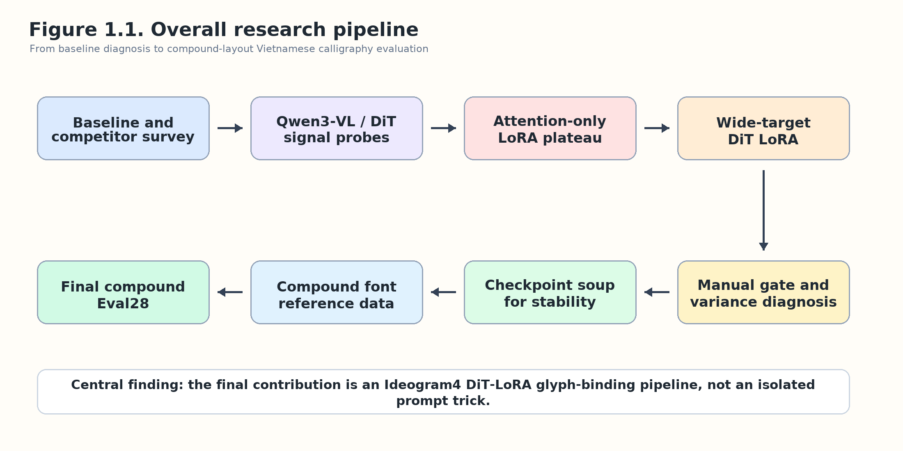

**Figure 1.1.** Overall research pipeline for Vietnamese calligraphy image generation. The pipeline begins with baseline observation, proceeds through Qwen3-VL/DiT signal diagnosis and wide-target LoRA training, then stabilizes compatible checkpoints through averaging before moving to compound-layout training and fixed-seed evaluation.

### 1.3.2. Domain-Specific Challenges

Vietnamese itself is the first hurdle. Six tones, numerous vowel variants (`â`, `ă`, `ê`, `ô`, `ơ`, `ư`), and a tiny mark error corrupts the whole word. In calligraphy, marks must blend into the brushwork rather than sitting on top like a printed font. Too detached and the image loses its calligraphic quality; too blended and readers misread them.

Fine-tuning and layout create the second hurdle. Attention-only LoRA reaches 32–39/60 and then stalls; adjusting attention alone does not fix glyph geometry. Worse, the same training recipe can produce either a decent checkpoint or a severe collapse; one warm-continue round, for instance, suddenly sprouted spurious nặng dots everywhere. Multi-word images multiply the difficulty because the model has to juggle layout, spacing, character identity, and local glyph geometry all at once [10], [24–26].

## 1.4. Literature Review

### 1.4.1. GAN-Based Methods

GANs train a generator and discriminator adversarially [1]. For Chinese calligraphy, GAN-based methods have been developed to convert printed glyphs into calligraphic style or to perform few-shot style transfer [2, 29, 30]. Mode collapse remains a known risk, and covering all Vietnamese diacritic combinations is difficult with this architecture.

### 1.4.2. Diffusion Models

Diffusion models generate images through iterative denoising [4, 5], more stable than GANs and capable of producing more diverse outputs. Latent Diffusion cuts computation by denoising in latent space rather than pixel space, which made high-resolution generation practical [6].

### 1.4.3. Diffusion Transformers and Multimodal Text Encoders

Diffusion Transformers swap the U-Net for transformer blocks in the denoising network [7]. Transformers make it easier to mix text tokens and image tokens, but accurate text rendering is still hard because the model has to convert symbolic signals into spatial geometry [10], [24–26]. For Vietnamese, the signals that matter are often tiny yet linguistically decisive.

Several recent models pair DiT with powerful text encoders [15], [17], [21–22]. Three open-source approaches were tested, revealing clearly different architectural choices:

- **Qwen-Image** (Qwen Team, 20B params, MMDiT, Apache 2.0, arXiv 2508.02324) uses the Qwen2.5-VL text encoder and achieves state-of-the-art Chinese text rendering [21]. My zero-shot experiments showed very limited visual knowledge of diacritical Vietnamese: wrong vowels, missing consonants, inconsistent renderings across seeds, and tone marks omitted or misplaced. The VRAM cost alone would have made it impractical for local iteration.

- **ERNIE-Image** (Baidu) pairs a Mistral3/Ministral3 text encoder with byte-level BPE [17]. Byte-level BPE works well for many languages but destabilizes Vietnamese syllable alignment; capitalized forms like `Ở`, `Ảnh`, `Ý`, `Ước`, `Nguyễn` can decompose into raw bytes and decode incorrectly. It preserves character count better than Qwen Image, but the tokenizer instability ruled it out for diacritic-accurate fine-tuning.

- **Ideogram4** (Ideogram AI, 9.3B params, published 2026-06-03) is Ideogram's first open-source text-to-image model, trained from scratch [15]. It uses a fully single-stream Diffusion Transformer (34 layers) with concatenated text/image tokens and no separate text/image branch. The text encoder is Qwen3-VL-8B-Instruct, with hidden states extracted from 13 intermediate layers [16]. It uses flow-matching [19–20] rather than pure DDPM, supports native resolution from 256 to 2048, and the FP8 base + BF16 LoRA design enables local fine-tuning. Among the open-weight models surveyed, Ideogram4 produces the best text rendering (surpassing Qwen-Image 20B, FLUX.2 32B, HunyuanImage 3.0 80B MoE).

A notable pattern across all three: they all use Qwen3-VL/Mistral3-family (or equivalent) text encoders for conditioning. The original research question about *linguistic signal in the Qwen family* stays relevant no matter which image generation backbone is chosen.

### 1.4.4. Parameter-Efficient Fine-Tuning

Full fine-tuning of large text-to-image models is expensive and risks degrading what the base model already knows. LoRA learns low-rank updates on selected modules while keeping the original weights frozen [8], which is a good fit for learning a specific calligraphic style without losing the base model's visual priors.

DreamBooth showed early on that targeted fine-tuning can specialize a generative model to a desired subject or concept [9]. The broader progress of image-text representation learning (CLIP, BLIP-2) makes clear how much image generation depends on conditioning quality [11, 12]. For LoRA specifically, scaling and rank behavior matter in practice, which is why careful control is maintained over adapter rank and update strength [27].

One finding worth flagging: LoRA target module selection matters more than one might expect. Attention-only LoRA could not push past the Vietnamese diacritic plateau, which required expanding into feed-forward and adaLN modulation to influence glyph geometry directly.

### 1.4.5. Commercial Models and Research Gap

**Existing works in adjacent areas.** Several adjacent research areas have explored calligraphy generation or Vietnamese text rendering, but none combine fine-tuning with Vietnamese diacritic accuracy targets:

- **Chinese calligraphy generation** uses GAN-based and diffusion-based methods (e.g. CalliGAN [2], Calliffusion [29], ZiGAN [30]) but targets a logographic script without tone marks; diacritic accuracy is not a defined metric. The reported metrics focus on visual similarity (SSIM [23], FID) and character-class recognition, not on tone-mark-level orthographic correctness.

- **Open-source text-to-image models** (Qwen-Image [21], ERNIE-Image [17], Ideogram4 [15]) report strong general text-rendering performance but only in their default languages (Chinese, English, general). Their published technical descriptions do not report Vietnamese diacritic rendering accuracy on stylized calligraphy, and the available models do not ship fine-tuning recipes for Vietnamese fonts.

- **Digital font rendering** (e.g. fontforge, CSS `@font-face`) gives perfect orthography but no calligraphic variation. It is not a learned system and does not address the brushwork dynamics that calligraphy requires.

- **Black-box commercial tools** (Nano Banana 2, GPT Image 1.5 High, Ideogram online) generate appealing Vietnamese calligraphy imagery but operate as closed systems: no published checkpoint, no reproducible seed control, no fine-tuning on private data. The output style cannot be adapted to a specific calligraphy font or school.

- **Evaluation methodology for stylized text** remains open. OCR engines such as Vintern-3B-R-beta achieve only 16.27% CER on model-generated Vietnamese calligraphy images (Section 13.7 of `eval_baseline_results_4w.md`), so most prior works cannot report reliable automated metrics and instead rely on qualitative samples.

**However, the following gap remains.** Across the existing landscape, no prior work has demonstrated a *reproducible, open-source fine-tuning pipeline that reports quantitative Vietnamese diacritic-accuracy numbers on stylized calligraphy* at the level achievable by this thesis (97.6% word-level accuracy, 4 errors out of 168 words on the Eval28 compound panel, Section 3.6.4). The closest published numbers are either:
- (a) qualitative visual comparisons without diacritic-accuracy metrics (most open-source text-to-image reports), or
- (b) digital-font rendering accuracies of ~100% but without any learned calligraphic dynamics, or
- (c) Chinese-logographic calligraphy accuracies that do not transfer to Vietnamese tone-mark evaluation.

**Therefore, this thesis fills a concrete, measurable gap.** It builds an open-source Ideogram4 DiT-LoRA pipeline that:
- targets Vietnamese diacritic accuracy as the primary, *quantified* evaluation metric (97.6% word-level on the Eval28 panel, Section 3.6.4);
- ships a reproducible checkpoint, training script, dataset, and evaluation panel (HF + GitHub, links in Abstract);
- documents an evidence-driven pipeline for one font (Thu Phap Thanh Cong Unicode) that other researchers can adapt to additional fonts and other languages with stacked diacritics (e.g. tonal languages in the same family).

Table 1.1 summarizes the competitive landscape.

**Table 1.1.** Comparison of competitors and baselines for Vietnamese calligraphy image generation.

| System / Method | Strengths | Limitations for This Work |
|---|---|---|
| Digital font rendering | Absolutely correct characters and diacritics | Static glyphs; no brushstroke variation |
| Black-box commercial tools | High image quality; convenient prompting | Default style; no fine-tuning on private data; hard to reproduce |
| Qwen Image | Powerful model family; initial registered direction | VRAM-intensive; weak Vietnamese baseline |
| ERNIE Image | Better character count preservation; occasional correct phrases | Character errors; byte-level BPE breaks syllable/diacritic alignment |
| Base Ideogram4 | Best open text-rendering foundation among tested approaches | Errors on difficult diacritics; poor multi-word layouts |
| Existing Chinese-calligraphy work (e.g. [2]) | Mature pipelines for logographic scripts | No tone-mark evaluation metric; no Vietnamese diacritic accuracy reported |
| Proposed DiT-LoRA pipeline | Learns specific font, reproducible, improves single-word and compound | Limited to one primary font and manual evaluation panel |

**Gap closed by this work:** the first reproducible, open-source, diacritic-accuracy-quantified pipeline for Vietnamese calligraphy image generation, with end-to-end artifacts (checkpoint + training script + dataset + evaluation panel) released for replication.

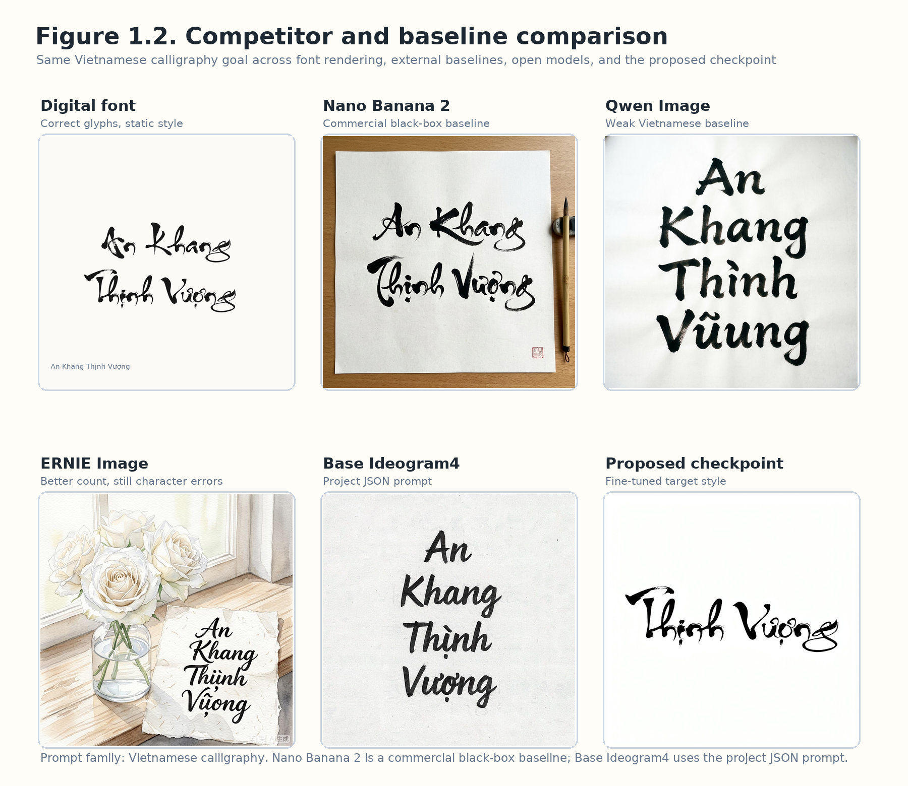

**Figure 1.2.** Visual comparison of competitor methods and the proposed checkpoint. Comparable Vietnamese calligraphy prompts are compared across digital font rendering, Nano Banana 2 as a black-box commercial image generator, Qwen Image, ERNIE Image, base Ideogram4, and the final fine-tuned Ideogram4 checkpoint. The figure is intended to show the gap between orthographic correctness, calligraphic naturalness, reproducibility, and fine-tuning capability.

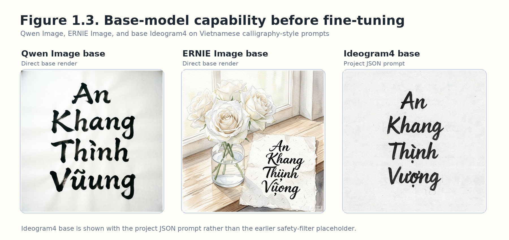

**Figure 1.3.** Base-model capability comparison before fine-tuning. Qwen Image, ERNIE Image, and base Ideogram4 are compared using archived Vietnamese calligraphy-style base renders. This figure separates base-model selection from LoRA improvement and clarifies why Ideogram4 was selected as the final experimental backbone.

## 1.5. Proposed Method and Contributions

The contribution:

> An Ideogram4 DiT-LoRA implementation for the registered Qwen Image objective of Vietnamese calligraphy image generation, organized as a glyph-binding pipeline to improve diacritic accuracy.

This is presented as an integrated pipeline, not a list of isolated tricks. Signal probes, LoRA target selection, checkpoint averaging, compound training, and manual evaluation only make sense when combined to address the same bottleneck.

Compared to the original Qwen-Image direction, the contribution has shifted in several ways. The backbone is Ideogram4, the bottleneck identified is DiT glyph binding rather than a globally diacritic-blind text encoder, and the objective expanded from reading individual words correctly to multi-word and long-sentence calligraphic behavior.

## 1.6. Thesis Structure

Chapter 2 covers the theoretical foundations: GANs, diffusion, Diffusion Transformers, Ideogram4, LoRA, FP8/BF16, and Vietnamese calligraphy characteristics. Chapter 3 describes the implementation, data, diagnostic probes, fine-tuning configuration, and evaluation results. Chapter 4 summarizes what the work contributes, where it falls short, and what comes next.

---

# 2. Theoretical Foundations

## 2.1. AI Image Generation: From GANs to Diffusion Transformers

GANs introduced adversarial image generation but never handled precise character control well [1]. DDPM and diffusion models brought stability by learning to reverse a noise-adding process [4, 5]. Latent Diffusion cut costs by operating in latent space [6]. Diffusion Transformers then replaced the convolutional backbone with transformers, a better fit when text and image tokens need to interact [7].

For Vietnamese calligraphy, the Diffusion Transformer has to do several things at once: understand the prompt, maintain calligraphic style, place text within a layout, and render small diacritical marks accurately. When errors happen, they are not OCR errors or font errors; they are binding errors between linguistic conditioning and visual geometry.

## 2.2. Ideogram4 Architecture

The Ideogram4 pipeline used in this work consists of three main components, based on the public technical description and the DiffSynth-Studio implementation used to load the model [15, 18].

**Table 2.1.** Overview of the three main components in the Ideogram4 pipeline.

| Component | Role | Significance for Vietnamese Calligraphy |
|---|---|---|
| Qwen3-VL text encoder | Encodes prompt and structured prompt | Provides conditioning that understands Vietnamese |
| Ideogram4 DiT | Generates image latent conditioned on text | Primary LoRA target |
| VAE | Decodes latent into 1024×1024 image | Produces final image |

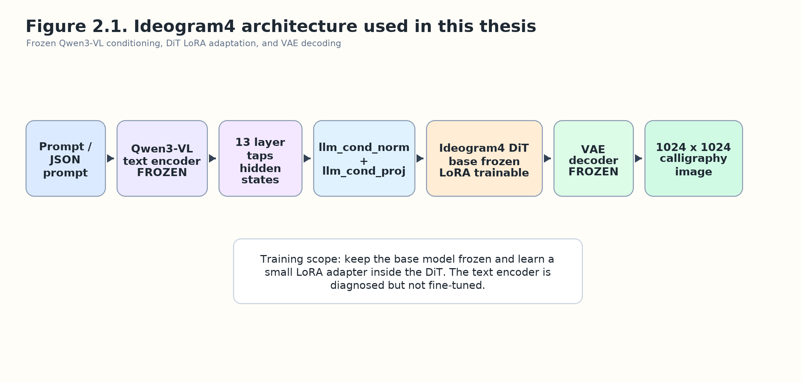

**Figure 2.1.** Ideogram4 architecture used in this thesis. The fine-tuning pipeline freezes the Qwen3-VL text encoder and Ideogram4 base weights, inserts LoRA adapters into selected DiT modules, and decodes the generated latent image through the VAE.

The Qwen3-VL text encoder is kept frozen. Ideogram4 extracts signals from multiple layer taps of the text encoder, concatenates them into a large conditioning vector, then projects through `llm_cond_norm + llm_cond_proj` into the DiT [15, 16]. The probes in this work examine both tap-space and projection-space to see how far the diacritic signal persists.

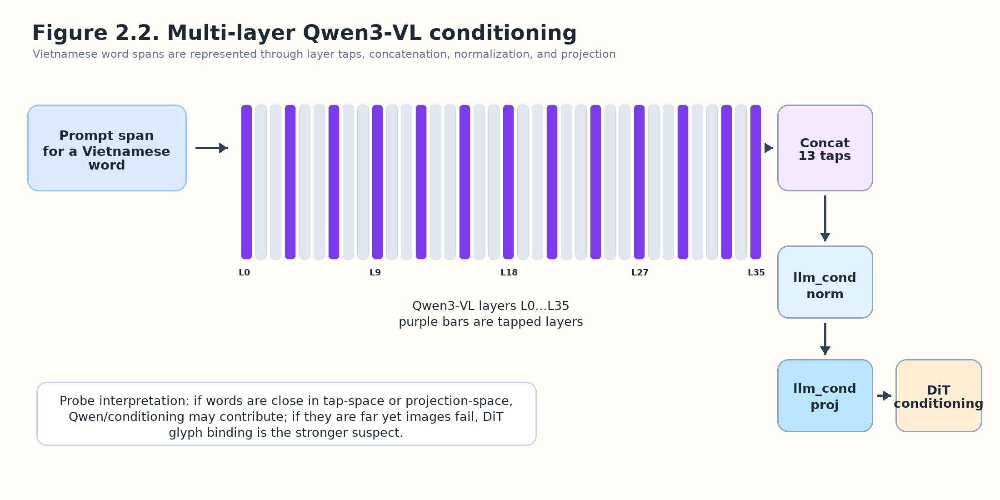

**Figure 2.2.** Multi-layer Qwen3-VL conditioning fed into the DiT. Hidden states from multiple Qwen3-VL layers are concatenated, normalized, and projected before entering the Ideogram4 DiT. This figure supports the diagnostic question of whether Vietnamese diacritic signal is already weak at the conditioning interface or is lost later during glyph binding.

The DiT is where LoRA is inserted. Key modules include attention, feed-forward, and adaLN modulation. When attention-only LoRA proved insufficient, expanding the target showed that the DiT needs influence through more channels to correct character geometry.

## 2.3. Parameter-Efficient Fine-Tuning Techniques

LoRA assumes weight updates can be approximated by the product of two low-rank matrices [8]. Given original weight `W`, LoRA adds:

```text
W' = W + B A * scale
```

FP8 base weights are kept frozen while the LoRA branch operates in BF16. This follows the general idea of parameter-efficient adaptation over frozen or quantized base models [8, 28]; the exact FP8/BF16 conversion details are specific to the local Ideogram4 pipeline. After training, checkpoints need conversion to the correctly scaled inference format.

When multiple LoRA checkpoints sit in the same optimization basin but have different error profiles, they are averaged. Averaging adapters reduces variance and produces more stable checkpoints without adding inference cost [13, 14].

## 2.4. Vietnamese Calligraphy: Visual and Linguistic Characteristics

Quốc ngữ calligraphy combines the Latin alphabet, the Vietnamese diacritic system, and calligraphic brushwork. A single word can carry multiple layers of marks: circumflex or horn diacritics on vowels, plus tone marks. Common errors in the experimental observations include missing tone marks, hỏi/ngã confusion, spurious nặng dots, vowel substitutions (`ư/u`, `ơ/o`, `â/ă/a`), and character drops in multi-word images.

On the Unicode side, Vietnamese can be composed or decomposed. Tokenizers handle uppercase and lowercase differently. Coverage is therefore checked at the token ID level rather than relying on visible characters alone. The final compound set covers 406 Vietnamese diacritical token IDs.

---

# 3. Implementation and Evaluation

## 3.1. System Setup

### 3.1.1. Hardware Configuration

**Table 3.1.** Hardware configuration.

| Component | Configuration |
|---|---|
| GPU | GPU with sufficient VRAM for Ideogram4 FP8 and LoRA training |
| Precision | FP8 base weights, BF16 LoRA |
| Storage | Stores checkpoints, rendered data, probe artifacts, and evaluation results |
| Runtime | Python, PyTorch, DiffSynth-Studio, safetensors |

### 3.1.2. Software Environment

**Table 3.2.** Software environment.

| Component | Role |
|---|---|
| DiffSynth-Studio | Load and inference Ideogram4 |
| PyTorch | LoRA training |
| safetensors | Checkpoint storage |
| HuggingFace Transformers | Tokenizer/text encoder |
| Experiment scripts | Build dataset, train, convert, render, probe |

### 3.1.3. Reproducible Experiment Process

Each experimental branch is managed with its own checkpoint name, log, and render folder. Evaluation panels use the same base seed to avoid confusing checkpoint improvements with seed variance. When a good checkpoint is found, it does not overwrite previous ones; it stays as an independent candidate.

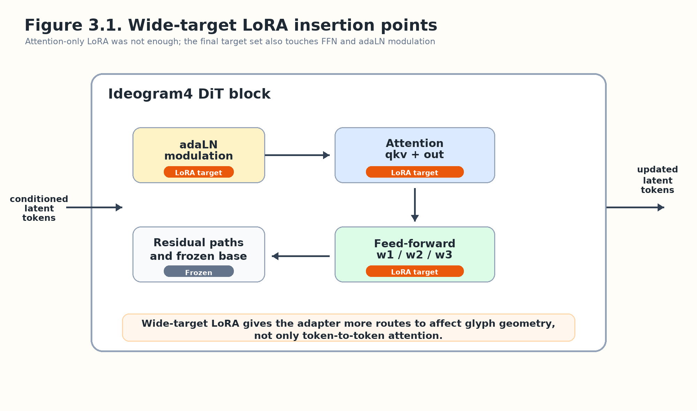

**Figure 3.1.** Wide-target LoRA insertion points in the Ideogram4 DiT. Compared with attention-only LoRA, the final target set includes attention projections, feed-forward layers, and adaLN modulation so that the adapter can influence both token interaction and glyph geometry.

## 3.2. Data and Preprocessing

### 3.2.1. Single-Word Data

The initial phase uses a list of diacritical Vietnamese words to generate single-word images. The fragile 60 panel measures easily confused words during fine-tuning. Each word is scored as correct or incorrect by manual inspection of the generated image, prioritizing orthographic and diacritic correctness over automatic metrics like SSIM.

### 3.2.2. Token Coverage

Token coverage is checked at the tokenizer level because the same character can map differently in uppercase and lowercase. Enumerating over the lexicon revealed 406 Vietnamese diacritical token IDs that needed coverage. That finding pushed the design toward compound data covering both cases rather than assuming one form would suffice; the generation command is in Appendix B.

### 3.2.3. Compound Dataset

The compound set consists of 4/5/7/8-word images split into two center-aligned lines, rendered from the Thu Phap Thanh Cong Unicode font for stable targets. In total:

```text
2808 compound images
147 supplementary single-word images
2955 metadata records
406/406 Vietnamese diacritical token IDs covered
```

The compound set was designed after observing that the model generates multi-word text better when trained directly on multi-word examples. As a result, multi-word layouts were brought into the training distribution instead of optimizing single words and hoping for automatic generalization to sentences.

### 3.2.4. Bounding-Box-Free Prompts

Bounding-box experiments produced disappointing results. Narrow cell-based or line-level bounding boxes were not consistently followed; some words overlapped in position or stayed incorrect. No-bbox prompts with center-aligned target images, on the other hand, let the model learn more natural layout rules. No-bounding-box prompts are therefore used for the compound bridge, letting the target data teach line alignment.

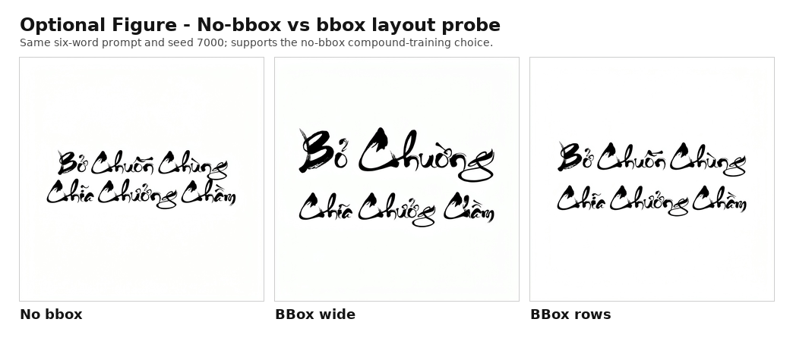

**Figure 3.2.** No-bounding-box and bounding-box layout comparison for compound prompts. The same six-word prompt is rendered under no-bbox, wide-bbox, and row-bbox conditions to show why the final compound data relies on centered target images rather than strict bounding-box instructions.

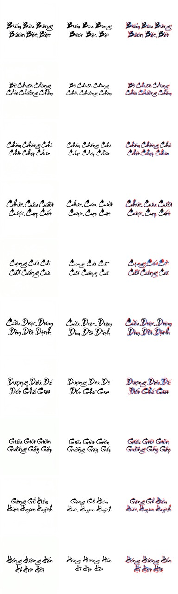

**Figure 3.3.** Font-rendered reference versus model-generated compound layout. The comparison verifies that the font-rendered compound targets are close enough to the model's natural centered two-line layout to serve as supervised training data while preserving exact Vietnamese characters and diacritics.

## 3.3. Diagnostic Probes

### 3.3.1. Qwen3-VL Signal Probe

The question was whether Qwen3-VL discards Vietnamese diacritic signal before the DiT ever sees it. The probe compares a canonical list of 990 words from `manifest_words.json` against a candidate lexicon of 7,165 words from the 7,184 set. The full report is in Appendix G. Results:

**Table 3.3.** Qwen3-VL signal probe results.

| Metric | Value |
|---|---:|
| Canonical words | 990 |
| Candidate lexicon | 7,165 |
| Elapsed time | 81.1 s |
| Span miss | 0 |
| Very hard | 42 |
| Hard | 225 |
| Medium | 567 |
| Easy | 156 |

Takeaway: Qwen3-VL is not globally blind to diacritics. But there is a large enough cluster of hard/very-hard words that Qwen signal can serve as a risk filter.

### 3.3.2. Cưu/Cừu/Cữu Family Probe

Training rounds kept producing `Cưu` and `Cữu` as `Cừu`, so a small probe on the six tones was run. The detailed report is in Appendix G:

```text
Cưu, Cừu, Cứu, Cửu, Cữu, Cựu
```

The probe measures both tap-space and proj-space after `llm_cond_norm + llm_cond_proj`. Results do not strongly support the hypothesis that `Cừu` is a global attractor in Qwen conditioning. This tilts the conclusion toward DiT/glyph-binding or deeper visual priors.

### 3.3.3. Probe Interpretation

Based on these probes, the strategy was not shifted entirely toward training the text encoder. Some words have nearby conditioning signals and can be mined, but many image errors occur even when Qwen signal remains distinguishable. For those words, the better direction is to fix DiT/glyph binding through LoRA and correctly distributed visual data.

## 3.4. Fine-Tuning Configuration

### 3.4.1. Attention-Only Baseline

Attention-only LoRA was tried first because it carries less risk and preserves the base model well. Results plateaued:

```text
Approximately 32-39/60 on the fragile panel
```

Vietnamese diacritic errors do not live solely in the attention pathway; intervention was needed in modules that more strongly affect stroke geometry.

### 3.4.2. Wide-Target DiT-LoRA

The LoRA target was expanded to the module groups in Table 3.4.

**Table 3.4.** LoRA module groups in the DiT.

| Module group | Target module(s) | Intended role |
|---|---|---|
| Attention input projection | `attention.qkv` | Adjust query/key/value text-image interaction |
| Attention output projection | `attention.o` | Adjust attention output integration |
| Feed-forward network | `feed_forward.w1`, `feed_forward.w2`, `feed_forward.w3` | Influence nonlinear glyph and stroke geometry |
| Adaptive layer normalization modulation | `adaln_modulation` | Influence conditioning strength and block-wise modulation |

The best single checkpoint reached 48/60. Warm-continue rounds were unpredictable: some improved, others dropped sharply (wide8, for instance, collapsed).

### 3.4.3. Gentle Warm-Continue

Gentle warm-continue uses a mild learning rate and starts from a good checkpoint. It was learned through experimentation that long blind chaining should be avoided. Each branch works better as an independent sample from the good region: if it passes the gate, it goes into the candidate soup.

### 3.4.4. Checkpoint Averaging

The `soup567` checkpoint was created by averaging the best r5, r6, r7 checkpoints:

```text
soup567 = mean(r5, r6, r7)
```

The result hit 52/60, beating every previous single checkpoint. Adding r9 to make `soup5679` stayed at 52/60, no gain but stable.

For the compound bridge, averaging continued:

```text
soup_e4r2r3
soup_e4r2r3r4
compound_lr3e5_from_gold4
soup_lr3e5_gold4_9to1
```

The `soup_e4r2r3r4` checkpoint became the stable Gold4 milestone with 6 errors on Eval28. From there, a follow-up branch at learning rate `3e-5` got to 5 errors; a light soup at 90% `lr3e5` branch + 10% Gold4 reached 4 errors and became the final compound checkpoint.

## 3.5. Evaluation Protocol

### 3.5.1. Manual Word-Level Evaluation

OCR and automatic metrics are not reliable enough for stylized diacritical calligraphy, so evaluation is done by hand. This aligns with the broader difficulty of accurate visual text rendering in generated images [10], [24–26]. A word counts as correct if the right characters, the right diacritics, and no extra marks that change meaning are visible. SSIM can serve as a supporting image-similarity reference [23], but it does not decide.

### 3.5.2. Single-Word Fragile Panel

The fragile panel of 60 contains difficult words that commonly suffer from diacritic or character errors. It is used to track single-word progress. The base seed stays fixed to avoid seed confounding.

### 3.5.3. Compound Eval28

Compound Eval28 has 28 images, each with multiple words (168 words total). This panel matches the project's end goal better than single words because it tests layout, spacing, font size, and the ability to keep diacritics correct when multiple tokens compete in the same image. Evaluation directories for the major checkpoints are in Appendix E.

### 3.5.4. Testing Preservation of Base Image Generation Capability

Character correctness alone is not enough; it is also necessary to check whether LoRA degrades what Ideogram4 already does well. A panel of context-rich prompts is included where Vietnamese calligraphic text sits in scenes like Tết greeting cards, ink paintings, festival banners, or poster layouts. This does not replace Eval28 but adds a practical angle: a good checkpoint must improve text without impoverishing backgrounds, layouts, lighting, and textures.

## 3.6. Results

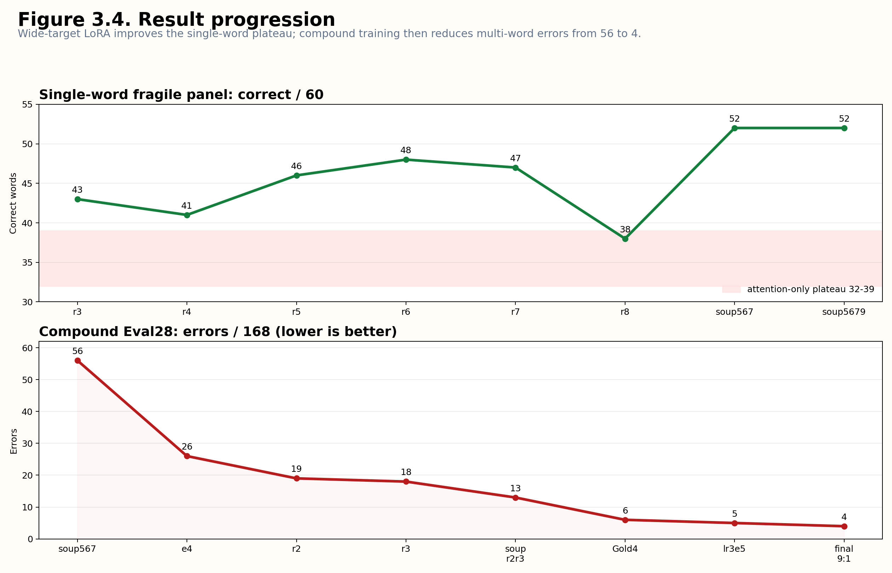

**Figure 3.4.** Result progression from the single-word plateau to the final compound checkpoint. The chart should summarize the improvement path from attention-only LoRA, wide-target single-word training, checkpoint soup, compound bridge training, Gold4, and the final `soup_lr3e5_gold4_9to1` checkpoint.

### 3.6.1. Single-Word Results

**Table 3.5.** Single-word panel results.

| Checkpoint / Phase | Correct Words / 60 |
|---|---:|
| Attention-only plateau | 32-39 |
| Wide-target r3 | 43 |
| Wide-target r4 | 41 |
| Wide-target r5 | 46 |
| Wide-target r6 | 48 |
| Wide-target r7 | 47 |
| Wide-target r8 | 38 |
| `soup567` | **52** |
| `soup5679` | **52** |

Wide-target broke through the attention-only plateau, but warm-continue is volatile. Checkpoint soup turned out to be more stable than betting on single checkpoints.

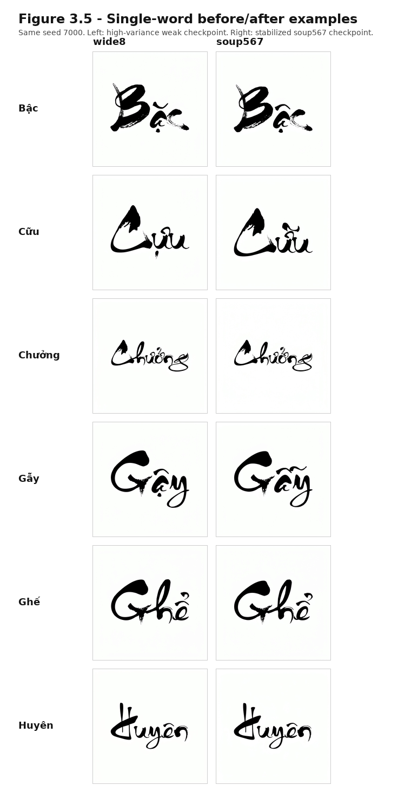

**Figure 3.5.** Before-and-after examples on difficult Vietnamese diacritical words. The panel compares difficult single-word cases before and after wide-target training and checkpoint averaging, illustrating reductions in tone-mark loss, wrong tone substitution, and vowel-diacritic confusion.

### 3.6.2. High-Variance Behavior

Wide8 is worth discussing because it used the same general recipe but dropped sharply to 38/60 with many spurious nặng dots. The log showed no checkpoint corruption or NaN. The most plausible explanation is that the diacritic subsystem sits near a high-variance boundary, and a normal update can push the model into a bad region. This is the rationale for relying on soup and manual gating.

### 3.6.3. Compound Bridge Results

**Table 3.6.** Compound Eval28 result progression.

| Checkpoint | Errors / 168 |
|---|---:|
| `soup567` baseline | 56 |
| `compound_bridge` e4 | 26 |
| `compound_bridge_r2` | 19 |
| `compound_bridge_r3` | 18 |
| `soup_e4r2r3` | 13 |
| `r4_from_soup` | 15 |
| `soup_e4r2r3r4` / Gold4 | 6 |
| `compound_lr3e5_from_gold4` | 5 |
| `soup_lr3e5_gold4_3to1` | 6 |
| `soup_lr3e5_gold4_9to1` | **4** |

The post-Gold4 process showed that both learning rate and soup ratio matter. The `5e-5` branch learned too aggressively and created many new errors. `2e-5` held at 6 errors but could not beat the milestone. `3e-5` turned out to be a better region, reducing solo errors to 5. When souping with Gold4, the 75/25 ratio dragged some old errors back; the 90/10 ratio kept most of the new branch's improvements and used Gold4 only as a light regularizer.

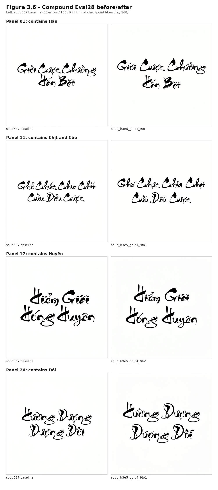

**Figure 3.6.** Compound Eval28 before-and-after comparison. Representative fixed-seed Eval28 prompts are shown for `soup567` and the final compound checkpoint `soup_lr3e5_gold4_9to1`, illustrating the reduction from 56/168 errors to 4/168 errors on multi-word two-line calligraphy images.

Final compound checkpoint (full registry in Appendix D):

```text
experiments/checkpoints/coverage_v10_compound_soup_lr3e5_gold4_9to1/step-soup_infer.safetensors
```

Remaining errors on Eval28:

```text
Hấn -> Hẩn
Chịt -> Chút
Huyên -> Huyện
Dôi -> Dồi
```

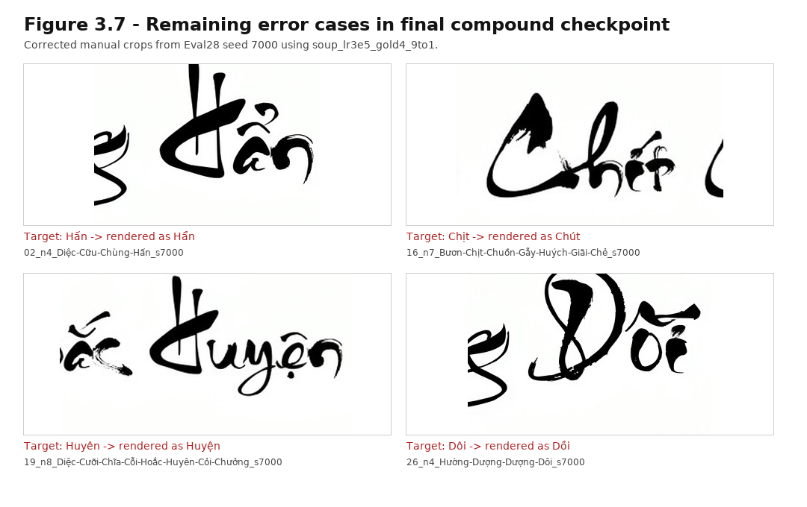

**Figure 3.7.** Remaining errors of the current compound gold checkpoint. The four residual Eval28 errors are concentrated in visually close Vietnamese diacritic or vowel variants rather than representing broad failure across the compound panel.

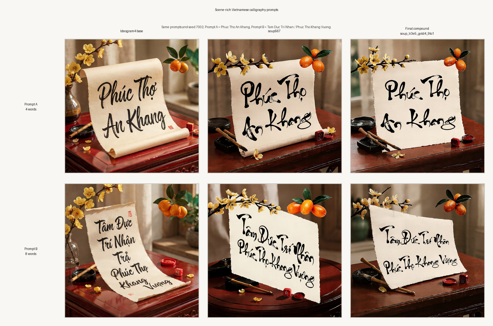

**Figure 3.8.** Testing the fine-tuned checkpoint with base image generation capability. Two Tết still-life prompts compare base Ideogram4, the single-word checkpoint soup `soup567`, and the final compound checkpoint `soup_lr3e5_gold4_9to1`. The figure checks whether Vietnamese calligraphy accuracy can improve while preserving composition, lighting, paper texture, and decorative background elements.

### 3.6.4. Current Gold Checkpoints

The final checkpoints identified during experimentation are summarized below. Full checkpoint paths and evaluation directory listings are recorded in Appendix D and Appendix E.

Single-word gold:

```text
experiments/checkpoints/coverage_v10_widetarget_soup567/step-soup_infer.safetensors
```

Compound gold:

```text
experiments/checkpoints/coverage_v10_compound_soup_lr3e5_gold4_9to1/step-soup_infer.safetensors
```

Both gold checkpoints have been published on Hugging Face at [phong09021998/vietnamese-calligraphy-ideogram4-lora](https://huggingface.co/phong09021998/vietnamese-calligraphy-ideogram4-lora) for public accessibility and replication. The restructured source code and thesis assets are on GitHub at [DoTuanPhong/qwen-calligraphy-ideogram4](https://github.com/DoTuanPhong/qwen-calligraphy-ideogram4).

---

# 4. Conclusion

## 4.1. Theoretical and Practical Value

### 4.1.1. Theoretical Value

The probes revealed a deviation from the initial hypothesis: Vietnamese diacritic errors in the Ideogram4 setup were not primarily a text-encoder-blindness problem. The initial assumption was that the text encoder was globally blind to diacritics. The probes showed otherwise. Qwen3-VL retains diacritic signal in many cases, and the real problem is the DiT not always binding that signal to the correct glyph geometry. This distinction changes the strategy: instead of retraining the text encoder, better results come from adjusting the DiT at modules that influence character geometry. This finding also validates the Phase 2 research question (Section 1.2.1) about Qwen-family conditioning, by showing that the bottleneck lies downstream of the encoder rather than in it.

The experimental results also show that single-word and multi-word problems are related but genuinely distinct. A checkpoint that writes single words reasonably well can still fail badly on two-line layouts. If the goal is long sentences, direct training on multi-word layouts is necessary rather than optional.

### 4.1.2. Practical Value

This work delivers a reproducible technical pipeline for Vietnamese calligraphy image generation. It covers data creation from the target font, coverage checking at the tokenizer level, LoRA fine-tuning, checkpoint conversion, checkpoint averaging, evaluation rendering with fixed seeds, and manual word-level inspection. Every component is kept reproducible because this problem is extremely sensitive to seeds, checkpoints, and prompt formatting.

The compound error reduction from 56/168 to 4/168 shows the pipeline can produce checkpoints that actually work for multi-word calligraphy. Beyond the numbers, the work serves as a foundation for applications in graphic design, personalized greeting images, digital cultural preservation, and calligraphy education.

## 4.2. Summary of Key Results

The improvement trajectory was clearer than expected. Attention-only LoRA stalled at 32–39/60; individual attention modules alone cannot fix the Vietnamese diacritic bottleneck. When the LoRA target was expanded to more DiT modules, the best single checkpoint climbed to 48/60. Averaging compatible checkpoints then produced `soup567` at 52/60.

The next important result is that single-word performance does not automatically transfer to multi-word images. The single-word gold checkpoint still produced many errors when writing two-line layouts. After compound bridge training, a follow-up at learning rate `3e-5`, and a light 90/10 soup with the Gold4 milestone, errors on Eval28 dropped from 56/168 to 4/168. The remaining errors cluster in a few difficult diacritic pairs, no longer a global collapse.

## 4.3. Current Limitations

The limitations should be noted transparently. The most immediate constraint is the cost of manual evaluation: images are scored by hand, which is reliable for calligraphy but slow. The Eval28 panel enables quick iteration, and seed 7000 enables fair comparison (after seed confounding was discovered), but stronger statistical conclusions need larger benchmarks and more seeds.

Style coverage is narrow. Only Thu Phap Thanh Cong Unicode was tested; generalization to other fonts is untested. Training data comes from digital calligraphy fonts, which gives control over orthography and diacritics but cannot capture the materiality of real hand-written calligraphy: paper texture, ink bleeding, imperfect pressure, the artist's personal layout.

Content scope needs expansion too. Compound 4/5/7/8-word images are closer to the goal than single words, but natural Vietnamese sentences need their own panel. And although LoRA keeps original weights frozen (reducing the risk of degrading the base model), adapter behavior has not yet been tested broadly on non-calligraphy prompts.

## 4.4. Future Directions

The pipeline works well on the current compound panel, but the next step should not be more of the same, chasing marginally better checkpoints on the same benchmark. What makes more sense is expanding scope, standardizing evaluation, and moving closer to practical use.

A promising next direction is trying multiple calligraphy fonts. The current work only covers Thu Phap Thanh Cong Unicode, but a practical system needs diverse Quốc ngữ styles. Building data for additional fonts would test whether the same DiT-LoRA pipeline can learn multiple brushwork styles while keeping diacritics accurate, marking the jump from a single-style model to a font-controllable system.

Real calligraphy photographs are another direction worth exploring. Digital font data gives stable orthographic supervision, but works by real artists carry richer brush dynamics, ink bleeding, paper texture, imperfect pressure, and more natural layout. A reasonable plan would be to use font-rendered data to stabilize characters and diacritics, then supplement with curated real calligraphy images to lift artistic quality.

Longer, more natural Vietnamese content is also needed. Compound data moved past the single-word problem, but practical applications call for greetings, proper names, slogans, or short poems. Future work should evaluate 9–16 word phrases with line breaks and layout rules closer to real calligraphic works.

On evaluation and deployment: larger benchmarks with more seeds and more sentence types are needed. A lightweight evaluator could flag missing marks, swapped marks, extra marks, or character substitutions, cutting manual scoring costs, though human judgment should remain the final call on aesthetic quality and ambiguous cases. Inference also needs to get cheaper before anyone can use this interactively. Quantization, optimized attention kernels, model compilation, or smaller adapters all point toward deploying the model into design tools, web services, or batch workflows.

The remaining 4 errors on Eval28 open another direction: anti-hallucination in text rendering. The model no longer fails broadly, but it still confuses some difficult diacritic and vowel pairs. Hard-word mining, replay data with correct glyphs, and layout-binding specialist adapters could address this group. As those pieces mature, the system could be integrated into a tool where users input Vietnamese text, pick a calligraphy style, choose an image background, and get high-resolution output for design, cultural preservation, or education.

Looking back, this work builds an empirical Ideogram4 fine-tuning pipeline for Vietnamese calligraphy image generation. What the results show: accurate Vietnamese rendering needs a strong base model, yes, but also knowledge of where the diacritic signal persists, targeting the right DiT modules, stabilizing checkpoints, and training directly on the multi-word layout distribution that real applications demand.

---

# References

[1] I. Goodfellow et al., "Generative adversarial nets," in *Proc. 27th Int. Conf. Neural Inf. Process. Syst. (NeurIPS)*, Montreal, QC, Canada, Dec. 2014, pp. 2672–2680.

[2] Z. Lyu, X. Bai, B. Shi, and C. Yao, "CalliGAN: Style and structure-aware Chinese calligraphy character generator," in *Proc. IEEE/CVF Conf. Comput. Vis. Pattern Recognit. Workshops (CVPRW)*, Seattle, WA, USA, Jun. 2020, pp. 494–495.

[3] J.-Y. Zhu, T. Park, P. Isola, and A. A. Efros, "Unpaired image-to-image translation using cycle-consistent adversarial networks," in *Proc. IEEE Int. Conf. Comput. Vis. (ICCV)*, Venice, Italy, Oct. 2017, pp. 2242–2251.

[4] J. Ho, A. Jain, and P. Abbeel, "Denoising diffusion probabilistic models," in *Proc. 34th Int. Conf. Neural Inf. Process. Syst. (NeurIPS)*, Vancouver, BC, Canada, Dec. 2020, pp. 6840–6851.

[5] J. Song, C. Meng, and S. Ermon, "Denoising diffusion implicit models," in *Proc. Int. Conf. Learn. Represent. (ICLR)*, Vienna, Austria, May 2021, pp. 1–22.

[6] R. Rombach, A. Blattmann, D. Lorenz, P. Esser, and B. Ommer, "High-resolution image synthesis with latent diffusion models," in *Proc. IEEE/CVF Conf. Comput. Vis. Pattern Recognit. (CVPR)*, New Orleans, LA, USA, Jun. 2022, pp. 10674–10685.

[7] W. Peebles and S. Xie, "Scalable diffusion models with transformers," in *Proc. IEEE/CVF Int. Conf. Comput. Vis. (ICCV)*, Paris, France, Oct. 2023, pp. 4172–4182.

[8] E. J. Hu et al., "LoRA: Low-rank adaptation of large language models," in *Proc. Int. Conf. Learn. Represent. (ICLR)*, Apr. 2022, pp. 1–16.

[9] N. Ruiz et al., "DreamBooth: Fine tuning text-to-image diffusion models for subject-driven generation," in *Proc. IEEE/CVF Conf. Comput. Vis. Pattern Recognit. (CVPR)*, Vancouver, BC, Canada, Jun. 2023, pp. 22500–22510.

[10] M. Chen et al., "TextDiffuser: Diffusion models as text painters," in *Proc. 37th Int. Conf. Neural Inf. Process. Syst. (NeurIPS)*, New Orleans, LA, USA, Dec. 2023, pp. 9353–9367.

[11] A. Radford et al., "Learning transferable visual models from natural language supervision," in *Proc. 38th Int. Conf. Mach. Learn. (ICML)*, Jul. 2021, pp. 8748–8763.

[12] Y. Li, S. Wang, J. Zhang, and K. Chen, "BLIP-2: Bootstrapping language-image pre-training with frozen image encoders and large language models," in *Proc. 40th Int. Conf. Mach. Learn. (ICML)*, Honolulu, HI, USA, Jul. 2023, pp. 1–13.

[13] T. Wortsman et al., "Model soups: Averaging weights of multiple fine-tuned models improves accuracy without increasing inference time," in *Proc. 39th Int. Conf. Mach. Learn. (ICML)*, Baltimore, MD, USA, Jul. 2022, pp. 23965–23998.

[14] P. Izmailov, D. Podoprikhin, T. Garipov, D. Vetrov, and A. G. Wilson, "Averaging weights leads to wider optima and better generalization," in *Proc. 34th Conf. Uncertainty Artif. Intell. (UAI)*, Monterey, CA, USA, Aug. 2018, pp. 876–885.

[15] Ideogram AI, "Ideogram 4.0 technical details," Ideogram AI, Tech. Rep., Jun. 2026. [Online]. Available: https://ideogram.ai/blog/ideogram-4.0/, accessed: Jun. 28, 2026.

[16] Qwen Team, "Qwen3-VL technical report," *arXiv:2511.21631*, Nov. 2025. [Online]. Available: https://arxiv.org/abs/2511.21631

[17] Baidu ERNIE-Image Team, "Introducing ERNIE-Image," Baidu, Tech. Rep., 2026. [Online]. Available: https://yiyan.baidu.com/blog/posts/ernie-image, accessed: Jun. 28, 2026.

[18] ModelScope Contributors, "DiffSynth-Studio: A diffusion engine," Open-source software repository, 2024–2026. [Online]. Available: https://github.com/modelscope/DiffSynth-Studio, commit `6d103c0`, accessed: Jun. 5, 2026.

[19] Y. Lipman, R. T. Q. Chen, H. Ben-Hamu, M. Nickel, and M. Le, "Flow matching for generative modeling," in *Proc. Int. Conf. Learn. Represent. (ICLR)*, Kigali, Rwanda, May 2023, pp. 1–17.

[20] P. Esser, S. Kulal, A. Blattmann, R. Rombach, B. Ommer, and J. Z. Kolter, "Scaling rectified flow transformers for high-resolution image synthesis," in *Proc. 41st Int. Conf. Mach. Learn. (ICML)*, Vienna, Austria, Jul. 2024, pp. 1–14.

[21] Qwen Team, "Qwen-Image technical report," *arXiv:2508.02324*, Aug. 2025. [Online]. Available: https://arxiv.org/abs/2508.02324

[22] Black Forest Labs, "FLUX: A fast lightweight universal model," Black Forest Labs, Tech. Rep., 2024. [Online]. Available: https://github.com/black-forest-labs/flux, accessed: Jun. 28, 2026.

[23] Z. Wang, A. C. Bovik, H. R. Sheikh, and E. P. Simoncelli, "Image quality assessment: From error visibility to structural similarity," *IEEE Trans. Image Process.*, vol. 13, no. 4, pp. 600–612, Apr. 2004.

[24] Y. Tuo, W. Xiang, J.-Y. He, Y. Geng, and X. Xie, "AnyText: Multilingual visual text generation and editing," in *Proc. Int. Conf. Learn. Represent. (ICLR)*, Vienna, Austria, May 2024, pp. 1–17.

[25] Y. Yang et al., "GlyphControl: Glyph conditional control for visual text generation," in *Proc. 37th Int. Conf. Neural Inf. Process. Syst. (NeurIPS)*, New Orleans, LA, USA, Dec. 2023, pp. 1–16.

[26] Z. Liu, X. Yang, H. Zhang, and A. C. Berg, "Glyph-ByT5: A customized text encoder for accurate visual text rendering," in *Proc. Eur. Conf. Comput. Vis. (ECCV)*, Milan, Italy, Sep.–Oct. 2024, pp. 1–18.

[27] D. Kalajdzievski, "A rank stabilization scaling factor for fine-tuning with LoRA," *arXiv:2312.03732*, Dec. 2023. [Online]. Available: https://arxiv.org/abs/2312.03732

[28] T. Dettmers, A. Pagnoni, A. Holtzman, and L. Zettlemoyer, "QLoRA: Efficient finetuning of quantized LLMs," in *Proc. 37th Int. Conf. Neural Inf. Process. Syst. (NeurIPS)*, New Orleans, LA, USA, Dec. 2023, pp. 10088–10115.

[29] Q. Liao, G. Xia, and Z. Wang, "Calliffusion: Chinese calligraphy generation and style transfer with diffusion modeling," *arXiv:2305.19124*, May 2023. [Online]. Available: https://arxiv.org/abs/2305.19124

[30] Q. Wen, S. Li, and B. Wang, "ZiGAN: Fine-grained Chinese calligraphy font generation via a few-shot style transfer approach," *arXiv:2108.03596*, Aug. 2021. [Online]. Available: https://arxiv.org/abs/2108.03596

---

# Appendices

## Appendix A: Main Wide-Target Training Command

```bash
bash experiments/scripts/v10/run_widetarget_gentle.sh \
  <warm_checkpoint> \
  <output_dir> \
  3 \
  5e-5 \
  <metadata_jsonl>
```

## Appendix B: Compound Data Generation Command

```bash
python3 experiments/scripts/v10/build_compound_dataset.py \
  --seed 27 \
  --img_sub images_compound_r5 \
  --out metadata_compound_2808_r5.jsonl
```

## Appendix C: Compound Branch Post-Processing

```bash
BASE_WEIGHT=0.1111111111 experiments/scripts/v10/postprocess_compound_branch.sh \
  no_training_session_for_manual_soup \
  experiments/checkpoints/coverage_v10_compound_lr3e5_from_gold4/step-11820.safetensors \
  experiments/checkpoints/coverage_v10_compound_soup_e4r2r3r4/step-soup.safetensors \
  experiments/checkpoints/coverage_v10_compound_soup_lr3e5_gold4_9to1 \
  experiments/results/coverage_v10_eval/compound_eval28_soup_lr3e5_gold4_9to1
```

The script computes soup using the formula `(BASE_WEIGHT * base + new) / (BASE_WEIGHT + 1)`, so `BASE_WEIGHT=0.1111111111` corresponds to approximately 90% `lr3e5` branch and 10% Gold4.

## Appendix D: Checkpoint Registry

```text
Single-word gold:
experiments/checkpoints/coverage_v10_widetarget_soup567/step-soup_infer.safetensors

Compound gold:
experiments/checkpoints/coverage_v10_compound_soup_lr3e5_gold4_9to1/step-soup_infer.safetensors
```

## Appendix E: Evaluation Directories

```text
experiments/results/coverage_v10_eval/compound_eval28_soup567_baseline
experiments/results/coverage_v10_eval/compound_eval28_bridge_e4
experiments/results/coverage_v10_eval/compound_eval28_bridge_r2
experiments/results/coverage_v10_eval/compound_eval28_bridge_r3
experiments/results/coverage_v10_eval/compound_eval28_soup_e4r2r3
experiments/results/coverage_v10_eval/compound_eval28_soup_e4r2r3r4
experiments/results/coverage_v10_eval/compound_eval28_lr3e5_from_gold4
experiments/results/coverage_v10_eval/compound_eval28_soup_lr3e5_gold4_9to1
```

## Appendix F: Remaining Errors of Compound Gold

```text
Hấn -> Hẩn
Chịt -> Chút
Huyên -> Huyện
Dôi -> Dồi
```

## Appendix G: Internal Probe Reports

```text
docs/probe_reports/_QWEN3_VL_SIGNAL_PROBE_2026-06-23.md
docs/probe_reports/_QWEN3_VL_CUU_FAMILY_PROBE_2026-06-24.md
```

## Appendix H: Comparison Image List

The following filenames are reserved for figures in `docs/thesis/figures/`.

**Table H.1.** Comparison image list.

| Figure | Filename | Expected Content |
|---|---|---|
| Figure 1.1 | `fig_1_1_research_pipeline.png` | Overall research pipeline from baseline observation, signal probing, LoRA training, checkpoint soup, compound training, and final evaluation |
| Figure 1.2 | `fig_1_2_competitor_baseline_comparison.png` | Digital font, Nano Banana 2 commercial baseline, Qwen Image, ERNIE Image, base Ideogram4, and proposed checkpoint |
| Figure 1.3 | `fig_1_3_base_model_capability_comparison.png` | Qwen Image, ERNIE Image, and base Ideogram4 on Vietnamese calligraphy-style prompts before fine-tuning |
| Figure 2.1 | `fig_2_1_ideogram4_architecture.png` | Ideogram4 architecture used in this thesis: frozen Qwen3-VL, DiT with LoRA adapters, and VAE decoder |
| Figure 2.2 | `fig_2_2_qwen3vl_multilayer_conditioning.png` | Multi-layer Qwen3-VL hidden-state taps, concatenation, normalization, projection, and DiT conditioning |
| Figure 3.1 | `fig_3_1_widetarget_lora_injection_points.png` | Wide-target LoRA insertion points: attention, feed-forward, and adaLN modulation |
| Figure 3.2 | `fig_3_2_no_bbox_vs_bbox_layout_comparison.png` | Same six-word compound prompt under no-bbox, wide-bbox, and row-bbox conditions |
| Figure 3.3 | `fig_3_3_font_reference_vs_model_generation.jpg` | Font-rendered reference compared with model-generated compound layout |
| Figure 3.4 | `fig_3_4_result_progression.png` | Result progression from attention-only LoRA to wide-target, `soup567`, compound bridge, Gold4, and final `soup_lr3e5_gold4_9to1` |
| Figure 3.5 | `fig_3_5_single_word_before_after_examples.png` | Before and after examples of difficult single words with wide-target/checkpoint soup |
| Figure 3.6 | `fig_3_6_compound_eval28_before_after.png` | Compound Eval28 examples comparing `soup567` with the final checkpoint `soup_lr3e5_gold4_9to1` |
| Figure 3.7 | `fig_3_7_remaining_error_cases.png` | Remaining errors: `Hấn`, `Chịt`, `Huyên`, `Dôi` |
| Figure 3.8 | `fig_3_8_calligraphy_with_base_model_capability.png` | Context-rich prompts testing whether the fine-tuned checkpoint preserves Ideogram4's base image generation capability when adding Vietnamese calligraphic text |

## Appendix I: Prompts Used for Comparison Figures

The prompt used for Figure 1.3 is the same short prompt for all base models, allowing Vietnamese calligraphy generation capability to be compared before fine-tuning:

```text
Traditional Vietnamese calligraphy written in black ink on white paper.
The text says "An Khang Thịnh Vượng".
```

Figure 3.8 uses context-rich JSON prompts to test the ability to combine calligraphic text with base image generation capability. The image set is rendered with the command:

```bash
python3 experiments/scripts/v10/render_thesis_scene_candidates.py \
  --preset phuc_duc \
  --seed 7002
```

The two text elements used in Figure 3.8 are:

```text
Prompt A:
Phúc Thọ
An Khang

Prompt B:
Tâm Đức Trí Nhân
Phúc Thọ Khang Vượng
```

The shared scene description in the prompt requests a Vietnamese Tết still life on a red lacquer table, including cream-colored dó/rice paper, black ink calligraphy, apricot blossoms, kumquat fruits, calligraphy brushes, ink stones, and red seals. The prompt also requests preserving background image details such as lighting, paper texture, lacquer reflections, and bokeh, while maintaining correct Vietnamese diacritics and avoiding Chinese character generation.

The two full JSON prompts are stored at:

```text
experiments/results/coverage_v10_eval/thesis_scene_candidates/phuc_duc_seed7002/prompt_phuc_tho_an_khang.json
experiments/results/coverage_v10_eval/thesis_scene_candidates/phuc_duc_seed7002/prompt_tam_duc_tri_nhan.json
```

These phrases were selected after trying several variants. The phrase `Lộc` was not used in the proposed figure because it tends to lose the `ô` circumflex, while `Vượng` produced more acceptable results in the same context.

## Appendix J: Reference and Evidence Checklist

This appendix records which parts of the thesis are supported by external literature and which parts are supported by internal experimental artifacts. It is intended as a final-submission checklist rather than a replacement for the main reference list.

**Table J.1.** Reference and evidence checklist.

| Thesis location | Claim or content needing support | Current support | Final action before submission |
|---|---|---|---|
| Abstract; Sections 1.1 and 1.2.1 | Qwen Image was the registered initial direction but was not selected as the final backbone due to VRAM cost and weak Vietnamese zero-shot rendering | Internal baseline observations; Figure 1.3; Qwen-Image technical report [21] | Keep Figure 1.3 and, if possible, retain the exact Qwen Image base render/log used in the comparison folder |
| Abstract; Sections 1.1, 1.2.1, and 1.4.3 | ERNIE Image preserved character count better than Qwen Image in some cases but still had many character-level errors | Internal ERNIE experiments and `docs/thesis/figures/ernie_image_base.jpeg`; ERNIE Image source [17] | Keep the selected ERNIE baseline image and avoid overclaiming beyond observed examples |
| Sections 1.1 and 1.4.3 | ERNIE/Mistral3 byte-level BPE created Vietnamese tokenizer instability, especially for capitalized diacritical forms | `docs/ernie_image_tokenization_report.vi.md`; `docs/v10_tokenizer_robustness_report.vi.md` | Preserve these reports or summarize them in a submitted appendix if the thesis package must be self-contained |
| Section 1.4.3 and Section 2.2 | Ideogram4 architecture, Qwen3-VL text encoder, multi-layer hidden-state conditioning, flow-matching, and FP8/BF16 practical pipeline | Ideogram4 technical documentation [15], Qwen3-VL technical report [16], DiffSynth-Studio [18], flow-matching references [19, 20] | Check that the final bibliography includes stable URLs or access dates for technical web sources |
| Sections 1.4.1-1.4.4 and Chapter 2 | GANs, diffusion models, latent diffusion, DiT, visual text rendering, LoRA, model soups, SSIM, and quantized/parameter-efficient fine-tuning | External references [1]-[14], [19]-[28] | No additional action unless the final university format requires DOI/arXiv URLs |
| Sections 3.2.2 and 3.2.3 | The compound dataset covers 406/406 Vietnamese diacritical token IDs and contains 2808 compound images plus supplementary single-word samples | `data/coverage_v10/metadata_compound_2808.jsonl`; Appendix B; tokenizer robustness reports | Keep the metadata file and build script with the submitted artifact package |
| Section 3.3 | Qwen3-VL is not globally blind to Vietnamese diacritics; the 990-vs-7165 probe produced 42 very-hard, 225 hard, 567 medium, and 156 easy cases | Internal probe reports in Appendix G and persisted probe results under `experiments/results/v10_phase1_probes/` | Keep probe reports and result tables because this is an internal empirical claim |
| Sections 3.4-3.6 | Attention-only plateau, wide-target improvement, `soup567`, compound bridge, Gold4, and final 4/168 Eval28 result | Appendix C, D, E, F; evaluation directories and checkpoint registry | Keep checkpoint names, eval folders, and manual scoring notes consistent with the final figures |
| Section 3.5 | Manual evaluation is the primary metric because OCR/automatic metrics are unreliable for stylized Vietnamese calligraphy | Visual text rendering references [10], [24–26], SSIM reference [23], and internal manual evaluation protocol | If the thesis committee asks for stronger evaluation, add a short note that OCR is not used as the final judge because the target domain is stylized calligraphy |
| Section 3.5.4 and Figure 3.8 | Fine-tuned checkpoints should preserve base image generation capability while improving Vietnamese calligraphy | Figure 3.8 and prompt records in Appendix I | Keep the exact prompts, seeds, and source images used to build Figure 3.8 |
| Section 4.4 | Future extension to real calligraphy photographs and multiple fonts | This is a proposed future direction, not a completed result | No citation is strictly required, but it should remain framed as future work rather than current achievement |

---

# Copyright and Tool Acknowledgements

This thesis acknowledges the models, open-source tools, and research materials used during the experimental process, including Ideogram4, Qwen3-VL, ERNIE Image reference materials, DiffSynth-Studio, PyTorch, HuggingFace Transformers, safetensors, and related works on image generation. All generated data, checkpoints, probes, and evaluation reports referenced in this thesis are used for academic research purposes.
